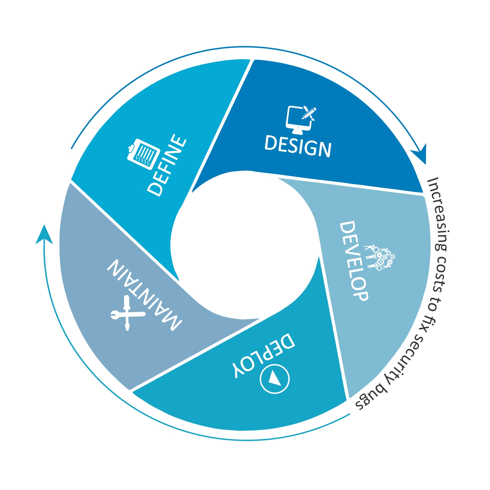
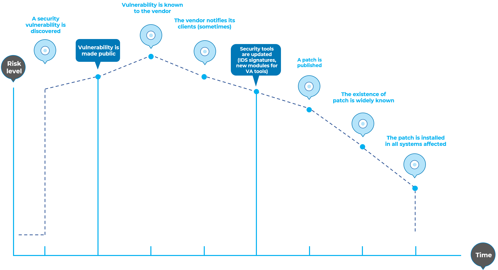
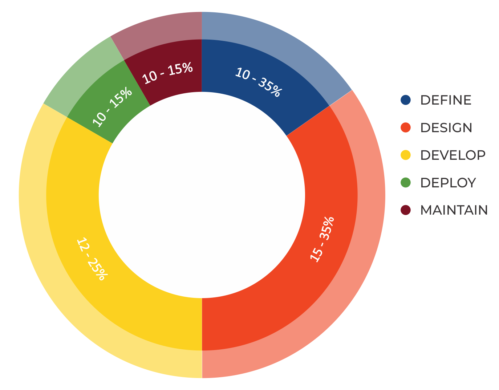
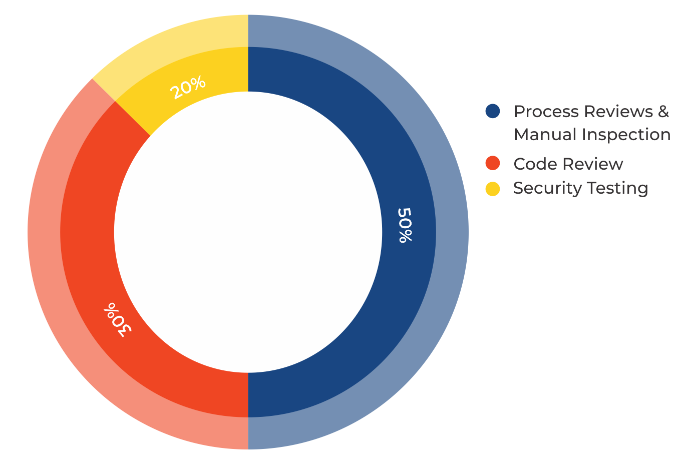
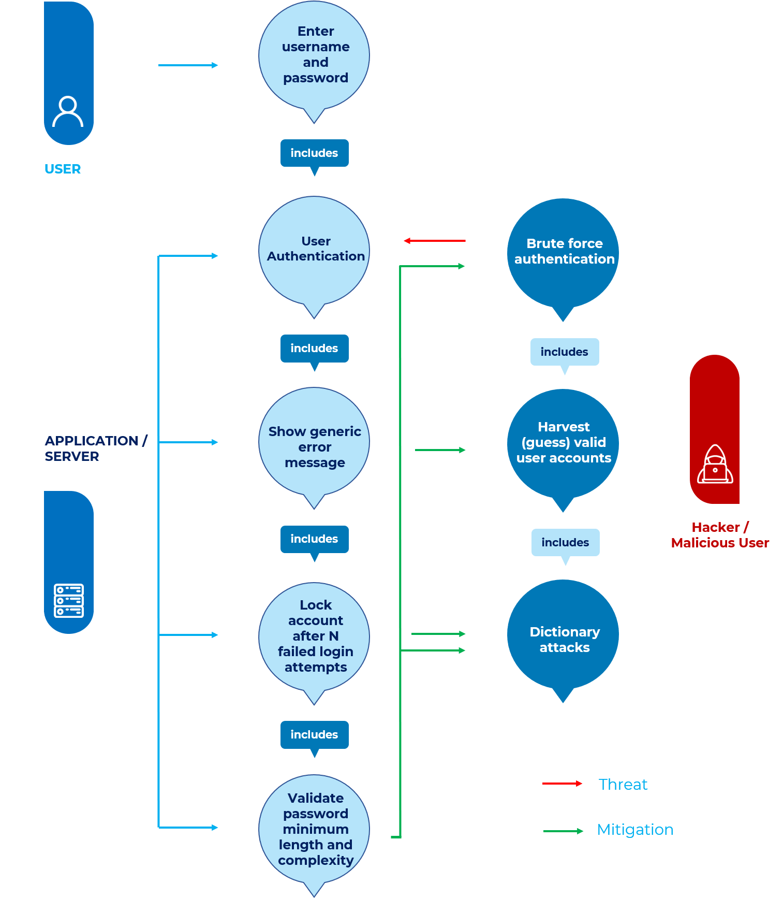

# Introducción

## El Proyecto de Pruebas OWASP

El Proyecto de Pruebas OWASP lleva muchos años en desarrollo. Su objetivo es ayudar a las personas a comprender el *qué*, *por qué*, *cuándo*, *dónde* y *cómo* de las pruebas de aplicaciones web. El proyecto ha proporcionado un marco de pruebas completo, no una simple lista de verificación o prescripción de problemas que deben abordarse. Los lectores pueden usar este marco como plantilla para crear sus propios programas de pruebas o para evaluar los procesos de otros. La Guía de Pruebas describe en detalle tanto el marco general de pruebas como las técnicas necesarias para implementarlo en la práctica.

Escribir la Guía de Pruebas ha resultado ser una tarea difícil. Lograr consenso y desarrollar contenido que permitiera a las personas aplicar los conceptos descritos en la guía, a la vez que les permitiera trabajar en su propio entorno y cultura, fue un reto. También fue un reto cambiar el enfoque de las pruebas de aplicaciones web, de las pruebas de penetración a las pruebas integradas en el ciclo de vida del desarrollo de software.

Sin embargo, el grupo está muy satisfecho con los resultados del proyecto. Numerosos expertos de la industria y profesionales de la seguridad, algunos de los cuales son responsables de la seguridad del software en algunas de las empresas más grandes del mundo, están validando el marco de pruebas. Este marco ayuda a las organizaciones a probar sus aplicaciones web para crear software fiable y seguro. El marco no se limita a señalar las áreas de debilidad, aunque esto es sin duda una consecuencia de muchas de las guías y listas de verificación de OWASP. Por ello, se tuvieron que tomar decisiones difíciles sobre la idoneidad de ciertas técnicas y tecnologías de prueba. El grupo comprende plenamente que no todos estarán de acuerdo con todas estas decisiones. Sin embargo, OWASP puede tomar la iniciativa y cambiar la cultura con el tiempo mediante la concienciación y la formación, basándose en el consenso y la experiencia.

El resto de esta guía se organiza de la siguiente manera: esta introducción abarca los prerrequisitos para probar aplicaciones web y el alcance de las pruebas. También abarca los principios de las pruebas exitosas y las técnicas de prueba, las mejores prácticas para la elaboración de informes y los casos de negocio para las pruebas de seguridad. El capítulo 3 presenta el marco de pruebas de OWASP y explica sus técnicas y tareas en relación con las distintas fases del ciclo de vida del desarrollo de software. El capítulo 4 explica cómo detectar vulnerabilidades específicas (p. ej., inyección SQL) mediante inspección de código y pruebas de penetración.

### Medición de la seguridad: la economía del software inseguro

Un principio básico de la ingeniería de software se resume en una cita de [Controlling Software Projects: Management, Measurement, and Estimates](https://isbnsearch.org/isbn/9780131717114) de [Tom DeMarco](https://en.wikiquote.org/wiki/Tom_DeMarco):

> No se puede controlar lo que no se puede medir.

Las pruebas de seguridad no son la excepción. Desafortunadamente, medir la seguridad es un proceso notoriamente difícil.

Un aspecto que debe destacarse es que las mediciones de seguridad abordan tanto los problemas técnicos específicos (p. ej., la prevalencia de una vulnerabilidad) como cómo estos problemas afectan la economía del software. La mayoría de los técnicos comprenderán al menos los problemas básicos, o pueden tener un conocimiento más profundo de las vulnerabilidades. Lamentablemente, pocos son capaces de traducir ese conocimiento técnico a términos monetarios y cuantificar el coste potencial de las vulnerabilidades para el negocio del propietario de la aplicación. Hasta que esto suceda, los CIO no podrán desarrollar un retorno preciso de la inversión en seguridad ni, posteriormente, asignar presupuestos adecuados para la seguridad del software.

Si bien estimar el coste del software inseguro puede parecer una tarea abrumadora, se ha trabajado mucho en este sentido. En 2020, el Consorcio para la Calidad del Software de TI [resumido](https://www.it-cisq.org/the-cost-of-poor-software-quality-in-the-us-a-2020-report/):

> ...el coste del software de baja calidad en EE. UU. en 2018 fue de aproximadamente 2,84 billones de dólares...

El marco descrito en este documento anima a las personas a medir la seguridad durante todo el proceso de desarrollo. De esta manera, pueden relacionar el coste del software inseguro con su impacto en el negocio y, en consecuencia, desarrollar procesos de negocio adecuados y asignar recursos para gestionar el riesgo. Recuerde que medir y probar aplicaciones web es aún más crucial que para otro tipo de software, ya que las aplicaciones web están expuestas a millones de usuarios a través de internet.

### ¿Qué son las pruebas?

Muchos aspectos deben probarse durante el ciclo de vida del desarrollo de una aplicación web, pero ¿qué significa realmente probar? El Oxford Dictionary of English define "prueba" como:

> **prueba** (sustantivo): procedimiento destinado a establecer la calidad, el rendimiento o la fiabilidad de algo, especialmente antes de su uso generalizado.

A efectos de este documento, las pruebas son un proceso que compara el estado de un sistema o aplicación con un conjunto de criterios. En el sector de la seguridad, las pruebas se realizan con frecuencia según un conjunto de criterios mentales que no están bien definidos ni completos. Por ello, muchos expertos consideran las pruebas de seguridad como una práctica poco fiable. El objetivo de este documento es cambiar esa percepción y facilitar que quienes no tienen conocimientos profundos de seguridad puedan marcar la diferencia en las pruebas.

### ¿Por qué realizar pruebas?

Este documento está diseñado para ayudar a las organizaciones a comprender qué comprende un programa de pruebas e identificar los pasos necesarios para desarrollar y operar un programa moderno de pruebas de aplicaciones web. La guía ofrece una visión general de los elementos necesarios para crear un programa integral de seguridad de aplicaciones web. Esta guía puede utilizarse como referencia y como metodología para determinar la brecha entre las prácticas existentes y las mejores prácticas del sector. Esta guía permite a las organizaciones compararse con sus pares del sector, comprender la magnitud de los recursos necesarios para probar y mantener el software, o prepararse para una auditoría. Este capítulo no profundiza en los detalles técnicos sobre cómo probar una aplicación, ya que su objetivo es proporcionar un marco organizativo de seguridad típico. Los detalles técnicos sobre cómo probar una aplicación, como parte de una prueba de penetración o una revisión de código, se abordarán en las secciones restantes de este documento.

### ¿Cuándo realizar pruebas?

Hoy en día, la mayoría de las personas no prueban el software hasta que ya está creado y en la fase de implementación de su ciclo de vida (es decir, cuando el código se ha creado e instanciado en una aplicación web funcional). Esta práctica suele ser muy ineficaz y costosa. Uno de los mejores métodos para prevenir la aparición de errores de seguridad en aplicaciones de producción es mejorar el ciclo de vida del desarrollo de software (SDLC) incluyendo la seguridad en cada una de sus fases. Un SDLC es una estructura impuesta al desarrollo de artefactos de software. Si actualmente no se utiliza un SDLC en su entorno, ¡es hora de elegir uno! La siguiente figura muestra un modelo SDLC genérico, así como el aumento estimado del coste de corregir errores de seguridad en dicho modelo.

\
*Figura 2-1: Modelo SDLC genérico*

Las empresas deben inspeccionar su SDLC general para garantizar que la seguridad sea una parte integral del proceso de desarrollo. Los SDLC deben incluir pruebas de seguridad para garantizar que la seguridad esté adecuadamente cubierta y que los controles sean eficaces durante todo el proceso de desarrollo.

### ¿Qué probar?

Puede ser útil pensar en el desarrollo de software como una combinación de personas, procesos y tecnología. Si estos son los factores que "crean" el software, entonces es lógico que sean los factores que deben probarse. Hoy en día, la mayoría de las personas generalmente prueban la tecnología o el software en sí.

Un programa de pruebas eficaz debe tener componentes que prueben lo siguiente:

- **Personas**: para garantizar que exista una formación y concienciación adecuadas;
- **Proceso**: para garantizar que existan políticas y estándares adecuados y que las personas sepan cómo seguirlos;
- **Tecnología**: para garantizar que el proceso haya sido eficaz en su implementación.

A menos que se adopte un enfoque holístico, probar únicamente la implementación técnica de una aplicación no revelará las vulnerabilidades operativas o de gestión que pudieran estar presentes. Al probar a las personas, las políticas y los procesos, una organización puede detectar problemas que posteriormente se manifestarían en defectos en la tecnología, erradicando así los errores de forma temprana e identificando las causas raíz de los defectos. Del mismo modo, probar sólo algunos de los problemas técnicos que pueden estar presentes en un sistema dará como resultado una evaluación de la postura de seguridad incompleta e inexacta.

Denis Verdon, Director de Seguridad de la Información de [Fidelity National Financial](https://www.fnf.com), presentó una excelente analogía para esta idea errónea en la Conferencia OWASP AppSec 2004 en Nueva York:

> Si los coches se construyeran como aplicaciones... las pruebas de seguridad solo asumirían impactos frontales. Los coches no se someterían a pruebas de balanceo ni a pruebas de estabilidad en maniobras de emergencia, eficacia de frenado, impacto lateral ni resistencia al robo.

### Cómo Referenciar Escenarios WSTG

Cada escenario tiene un identificador con el formato `WSTG-<categoría>-<número>`, donde: 'categoría' es una cadena de 4 caracteres en mayúsculas que identifica el tipo de prueba o punto débil, y 'número' es un valor numérico con relleno de ceros del 01 al 99. Por ejemplo: `WSTG-INFO-02` es la segunda prueba de Recopilación de Información.

Los identificadores pueden cambiar entre versiones, por lo que es preferible que otros documentos, informes o herramientas utilicen el formato `WSTG-<versión>-<categoría>-<número>`, donde `versión` es la etiqueta de la versión sin puntuación. Por ejemplo, `WSTG-v42-INFO-02` se entendería como la segunda prueba de recopilación de información de la versión 4.2.

Si se utilizan identificadores sin incluir el elemento `<versión>`, se debe asumir que se refieren al contenido más reciente de la Guía de Pruebas de Seguridad Web. Obviamente, a medida que la guía crece y cambia, esto se vuelve problemático, por lo que los escritores o desarrolladores deben incluir el elemento `versión`.

#### Enlaces

Los enlaces a los escenarios de la Guía de Pruebas de Seguridad Web deben realizarse mediante enlaces versionados, no con `stable` ni `latest`, que sin duda cambiarán con el tiempo. Sin embargo, la intención del equipo del proyecto es que los enlaces versionados no cambien. Por ejemplo: «https://owasp.org/www-project-web-security-testing-guide/v42/4-Pruebas_de_Seguridad_de_aplicaciones_Web/01-Information_Gathering/02-Fingerprint_Web_Server». Nota: El elemento «v42» se refiere a la versión 4.2.

### Comentarios y sugerencias

Como en todos los proyectos de OWASP, agradecemos sus comentarios y sugerencias. Nos interesa especialmente saber que nuestro trabajo se utiliza y que es eficaz y preciso.

## Principios de las pruebas

Existen algunos conceptos erróneos comunes al desarrollar una metodología de pruebas para detectar errores de seguridad en software. Este capítulo abarca algunos de los principios básicos que los profesionales deben tener en cuenta al realizar pruebas de seguridad en software.

### No existe una solución milagrosa

Aunque es tentador pensar que un escáner de seguridad o un firewall de aplicaciones ofrecerá muchas defensas contra ataques o identificará multitud de problemas, en realidad no existe una solución milagrosa para el problema del software inseguro. El software de evaluación de seguridad de aplicaciones, si bien es útil como primer paso para encontrar soluciones fáciles, generalmente es inmaduro e ineficaz para realizar evaluaciones exhaustivas o proporcionar una cobertura de pruebas adecuada. Recuerde que la seguridad es un proceso, no un producto.

### Piense estratégicamente, no tácticamente

Los profesionales de la seguridad se han dado cuenta de la falacia del modelo de parchear y penetrar, que prevaleció en la seguridad de la información durante la década de 1990. Este modelo implica corregir un error reportado, pero sin una investigación adecuada de la causa raíz. Este modelo suele asociarse con la ventana de vulnerabilidad, también conocida como ventana de exposición, que se muestra en la figura a continuación. La evolución de las vulnerabilidades en el software común utilizado en todo el mundo ha demostrado la ineficacia de este modelo. Para obtener más información sobre las ventanas de exposición, consulte [Schneier on Security](https://www.schneier.com/crypto-gram/archives/2000/0915.html).

Estudios de vulnerabilidades como el [Informe de Amenazas de Seguridad de Symantec](https://www.symantec.com/security-center/threat-report) han demostrado que, dado el tiempo de reacción de los atacantes a nivel mundial, la ventana típica de vulnerabilidad no proporciona tiempo suficiente para la instalación de parches, ya que el tiempo transcurrido entre el descubrimiento de una vulnerabilidad y el desarrollo y lanzamiento de un ataque automatizado contra ella disminuye cada año.

Existen varias suposiciones incorrectas en el modelo de parchear y penetrar. Muchos usuarios creen que los parches interfieren con el funcionamiento normal o podrían dañar las aplicaciones existentes. También es incorrecto asumir que todos los usuarios conocen los parches recién publicados. Por lo tanto, no todos los usuarios de un producto aplicarán parches, ya sea porque creen que la aplicación de parches puede interferir con el funcionamiento del software o porque desconocen su existencia.

\
*Figura 2-2: Ventana de Vulnerabilidad*

Es fundamental integrar la seguridad en el Ciclo de Vida de Desarrollo de Software (SDLC) para evitar problemas de seguridad recurrentes en una aplicación. Los desarrolladores pueden integrar la seguridad en el SDLC mediante el desarrollo de estándares, políticas y directrices que se ajusten y funcionen con la metodología de desarrollo. El modelado de amenazas y otras técnicas deben utilizarse para asignar los recursos adecuados a las partes del sistema con mayor riesgo.

### El SDLC es clave

El SDLC es un proceso bien conocido por los desarrolladores. Al integrar la seguridad en cada fase del SDLC, se logra un enfoque holístico de la seguridad de las aplicaciones que aprovecha los procedimientos ya implementados en la organización. Tenga en cuenta que, si bien los nombres de las distintas fases pueden variar según el modelo SDLC utilizado por la organización, cada fase conceptual del arquetipo SDLC se utilizará para desarrollar la aplicación (es decir, definir, diseñar, desarrollar, implementar y mantener). Cada fase incluye consideraciones de seguridad que deben formar parte del proceso existente para garantizar un programa de seguridad rentable e integral.

Existen varios marcos de SDLC seguros que ofrecen asesoramiento tanto descriptivo como prescriptivo. Que una persona adopte el asesoramiento descriptivo o prescriptivo depende de la madurez del proceso SDLC. En esencia, el asesoramiento prescriptivo muestra cómo debería funcionar el SDLC seguro, y el descriptivo muestra cómo se utiliza en el mundo real. Ambos tienen su lugar. Por ejemplo, si no sabe por dónde empezar, un marco prescriptivo puede ofrecer una lista de posibles controles de seguridad que pueden aplicarse dentro del ciclo de vida del desarrollo de software (SDLC). El asesoramiento descriptivo puede ayudar a guiar el proceso de decisión al presentar lo que ha funcionado bien en otras organizaciones. Los SDLC descriptivos y seguros incluyen BSIMM; y los prescriptivos incluyen el Modelo de Madurez de Garantía de Software Abierto (OpenSAMM) de OWASP y las partes 1 a 7 de la norma ISO/IEC 27034 (https://www.iso27001security.com/html/27034.html), todas publicadas (excepto la parte 4).

### Probar con Anticipación y con Frecuencia

Cuando un error se detecta con antelación dentro del SDLC, se puede solucionar con mayor rapidez y a un menor coste. En este sentido, un error de seguridad no se diferencia de un error funcional o de rendimiento. Un paso clave para que esto sea posible es capacitar a los equipos de desarrollo y control de calidad sobre los problemas de seguridad comunes y las formas de detectarlos y prevenirlos. Si bien las nuevas bibliotecas, herramientas o lenguajes pueden ayudar a diseñar programas con menos errores de seguridad, surgen nuevas amenazas constantemente y los desarrolladores deben ser conscientes de las amenazas que afectan al software que desarrollan. La formación en pruebas de seguridad también ayuda a los desarrolladores a adquirir la mentalidad adecuada para probar una aplicación desde la perspectiva de un atacante. Esto permite que cada organización considere los problemas de seguridad como parte de sus responsabilidades.

### Automatización de pruebas

En las metodologías de desarrollo modernas, como (entre otras): ágil, DevOps/DevSecOps o desarrollo rápido de aplicaciones (RAD), se debe considerar la integración de pruebas de seguridad en los flujos de trabajo de integración continua/despliegue continuo (CI/CD) para mantener la información/análisis de seguridad de referencia e identificar debilidades de fácil acceso. Esto se puede lograr aprovechando las pruebas dinámicas de seguridad de aplicaciones (DAST), las pruebas estáticas de seguridad de aplicaciones (SAST) y el análisis de composición de software (SCA) o las herramientas de seguimiento de dependencias durante los flujos de trabajo de lanzamiento automatizado estándar o de forma programada regularmente.

### Comprenda el Alcance de la Seguridad

Es importante saber cuánta seguridad requerirá un proyecto determinado. Los activos que se protegerán deben clasificarse de acuerdo con su gestión (p. ej., confidenciales, secretos, ultrasecretos). Se recomienda consultar con un asesor legal para garantizar el cumplimiento de los requisitos de seguridad específicos. En EE. UU., los requisitos pueden provenir de regulaciones federales, como la Ley Gramm-Leach-Bliley (https://www.ftc.gov/business-guidance/privacy-security/gramm-leach-bliley-act), o de leyes estatales, como la Ley SB-1386 de California (https://leginfo.legislature.ca.gov/faces/billTextClient.xhtml?bill_id=200120020SB1386). Para las organizaciones con sede en países de la UE, pueden aplicarse tanto las regulaciones específicas del país como las directivas de la UE. Por ejemplo, la Directiva 96/46/CE4 y el Reglamento (UE) 2016/679 (Reglamento General de Protección de Datos) establecen la obligación de tratar los datos personales en las solicitudes con la debida diligencia, independientemente de la aplicación. En determinadas circunstancias, las organizaciones no pertenecientes a la UE también podrían estar obligadas a cumplir con el Reglamento General de Protección de Datos.

### Desarrollar la mentalidad adecuada

Probar con éxito una aplicación para detectar vulnerabilidades de seguridad requiere pensar de forma innovadora. Los casos de uso habituales probarán el comportamiento normal de la aplicación cuando un usuario la utilice de la forma esperada. Unas buenas pruebas de seguridad requieren ir más allá de lo esperado y pensar como un atacante que intenta vulnerar la seguridad de la aplicación. El pensamiento creativo puede ayudar a determinar qué datos inesperados pueden provocar que una aplicación falle de forma insegura. También puede ayudar a detectar suposiciones de los desarrolladores web que no siempre son ciertas y cómo se pueden subvertir. Una razón por la que las herramientas automatizadas no son eficaces para detectar vulnerabilidades es que no piensan de forma creativa. El pensamiento creativo debe aplicarse caso por caso, ya que la mayoría de las aplicaciones web se desarrollan de forma única (incluso utilizando marcos de trabajo comunes).

### Comprender el tema

Una de las primeras iniciativas importantes de cualquier buen programa de seguridad debería ser exigir una documentación precisa de la aplicación. La arquitectura, los diagramas de flujo de datos, los casos de uso, etc., deben registrarse en documentos formales y estar disponibles para su revisión. Las especificaciones técnicas y los documentos de la aplicación deben incluir información que enumere no solo los casos de uso deseados, sino también los casos de uso específicamente prohibidos. Finalmente, es recomendable contar con al menos una infraestructura de seguridad básica que permita la monitorización y el análisis de tendencias de ataques contra las aplicaciones y la red de una organización (por ejemplo, sistemas de detección de intrusiones).

### Use las herramientas adecuadas

Si bien ya hemos mencionado que no existe una solución milagrosa, las herramientas desempeñan un papel fundamental en el programa de seguridad general. Existe una gama de herramientas comerciales y de código abierto que pueden automatizar muchas tareas rutinarias de seguridad. Estas herramientas pueden simplificar y acelerar el proceso de seguridad al ayudar al personal de seguridad en sus tareas. Sin embargo, es importante comprender exactamente qué pueden y qué no pueden hacer estas herramientas para evitar que se sobrevendan o se utilicen incorrectamente.

### El secreto está en los detalles

Es fundamental no realizar una revisión de seguridad superficial de una aplicación y darla por completa. Esto generará una falsa sensación de confianza que puede ser tan peligrosa como no haber realizado una revisión de seguridad previamente. Es fundamental revisar cuidadosamente los hallazgos y descartar cualquier falso positivo que pueda quedar en el informe. Informar sobre un hallazgo de seguridad incorrecto a menudo puede socavar la validez del mensaje del resto del informe. Se debe verificar cuidadosamente que se haya probado cada sección posible de la lógica de la aplicación y que se haya explorado cada escenario de uso en busca de posibles vulnerabilidades.

### Usar el código fuente cuando esté disponible

Si bien los resultados de las pruebas de penetración de caja negra pueden ser impresionantes y útiles para demostrar cómo se exponen las vulnerabilidades en un entorno de producción, no son la forma más efectiva ni eficiente de proteger una aplicación. Es difícil que las pruebas dinámicas prueben todo el código base, especialmente si existen muchas sentencias condicionales anidadas. Si el código fuente de la aplicación está disponible, debe entregarse al personal de seguridad para que les ayude durante la revisión. Es posible descubrir vulnerabilidades en el código fuente de la aplicación que pasarían desapercibidas durante una prueba de caja negra.

### Desactivar controles de compensación para testers

El tráfico de pruebas debe permitirse mediante controles de compensación, como un firewall de aplicaciones web (WAF). Si bien un WAF puede bloquear muchos ataques a una aplicación, un atacante sofisticado puede eludir el control y explotar la aplicación subyacente vulnerable con suficiente tiempo y dedicación. Al igual que al proporcionar acceso al código fuente, desactivar el control de compensación permite al personal de seguridad dedicar toda su atención a la lógica de la aplicación. Una prueba de penetración de caja blanca busca detectar vulnerabilidades de seguridad en el propio producto, no en los sistemas que redirigen el tráfico al entorno de producción.

### Desarrollar métricas

Una parte importante de un buen programa de seguridad es la capacidad de determinar si las cosas están mejorando. Es importante realizar un seguimiento de los resultados de las pruebas y desarrollar métricas que revelen las tendencias de seguridad de las aplicaciones dentro de la organización.

Unas buenas métricas mostrarán:

- Si se requiere más formación;
- Si existe algún mecanismo de seguridad específico que el equipo de desarrollo no comprende claramente; Si el número total de problemas de seguridad detectados está disminuyendo.

Las métricas consistentes, que se pueden generar de forma automatizada a partir del código fuente disponible, también ayudarán a la organización a evaluar la eficacia de los mecanismos implementados para reducir los errores de seguridad en el desarrollo de software. Desarrollar métricas no es fácil, por lo que usar un estándar como el proporcionado por el [IEEE](https://ieeexplore.ieee.org/document/237006) es un buen punto de partida.

### Documentar los resultados de las pruebas

Para concluir el proceso de pruebas, es importante generar un registro formal de las acciones de prueba realizadas, quién las realizó, cuándo y los detalles de los hallazgos. Es recomendable acordar un formato aceptable para el informe que sea útil para todas las partes involucradas, como desarrolladores, gestión de proyectos, propietarios de la empresa, departamento de TI, auditoría y cumplimiento normativo.

El informe debe identificar claramente al propietario de la empresa dónde existen riesgos importantes y hacerlo de forma suficiente para obtener su respaldo para las medidas de mitigación posteriores. El informe también debe ser claro para el desarrollador, identificando la función exacta afectada por la vulnerabilidad y las recomendaciones asociadas para resolver los problemas en un lenguaje que el desarrollador comprenda. El informe también debe permitir que otro evaluador de seguridad reproduzca los resultados. La redacción del informe no debe ser excesivamente tediosa para el evaluador de seguridad. Los evaluadores de seguridad no suelen ser reconocidos por sus habilidades de escritura creativa, y acordar un informe complejo puede dar lugar a casos en los que los resultados de las pruebas no se documenten correctamente. Usar una plantilla de informe de pruebas de seguridad puede ahorrar tiempo y garantizar que los resultados se documenten de forma precisa y consistente, y en un formato adecuado para el público.

## Explicación de las técnicas de prueba

Esta sección presenta una descripción general de diversas técnicas de prueba que se pueden emplear al desarrollar un programa de pruebas. No presenta metodologías específicas para estas técnicas, ya que esta información se trata en el Capítulo 3. Esta sección se incluye para contextualizar el marco que se presenta en el siguiente capítulo y para destacar las ventajas o desventajas de algunas de las técnicas que deben considerarse. En particular, abordaremos:

- Inspecciones y revisiones manuales
- Modelado de amenazas
- Revisión de código
- Pruebas de penetración

## Inspecciones y Revisiones Manuales

### Resumen

Las inspecciones manuales son revisiones humanas que suelen evaluar las implicaciones de seguridad de las personas, las políticas y los procesos. También pueden incluir la inspección de decisiones tecnológicas, como los diseños arquitectónicos. Suelen llevarse a cabo mediante el análisis de documentación o entrevistas con los diseñadores o propietarios del sistema.

Si bien el concepto de inspecciones manuales y revisiones humanas es simple, pueden ser una de las técnicas más potentes y efectivas disponibles. Al preguntar a alguien cómo funciona algo y por qué se implementó de una manera específica, el tester puede determinar rápidamente si es probable que existan problemas de seguridad. Las inspecciones y revisiones manuales son una de las pocas maneras de evaluar el propio proceso del ciclo de vida del desarrollo de software y de garantizar que se cuente con una política o un conjunto de habilidades adecuadas.

Como ocurre con muchos aspectos de la vida, al realizar inspecciones y revisiones manuales se recomienda adoptar un modelo de "confiar, pero verificar". No todo lo que se le muestra o se le dice al tester será preciso. Las revisiones manuales son especialmente útiles para comprobar si el personal comprende el proceso de seguridad, conoce las políticas y posee las habilidades necesarias para diseñar o implementar aplicaciones seguras.

Otras actividades, como la revisión manual de la documentación, las políticas de codificación segura, los requisitos de seguridad y los diseños arquitectónicos, deben realizarse mediante inspecciones manuales.

### Ventajas

- No requiere tecnología de soporte
- Se puede aplicar a diversas situaciones
- Flexible
- Fomenta el trabajo en equipo
- Se encuentra en las primeras etapas del ciclo de vida del desarrollo de software (SDLC)

### Desventajas

- Puede consumir mucho tiempo
- El material de soporte no siempre está disponible
- Requiere una gran capacidad de reflexión y habilidades humanas para ser eficaz

## Modelado de amenazas

### Resumen

El modelado de amenazas se ha convertido en una técnica popular para ayudar a los diseñadores de sistemas a analizar las amenazas de seguridad que sus sistemas y aplicaciones podrían enfrentar. Por lo tanto, el modelado de amenazas puede considerarse una evaluación de riesgos para las aplicaciones. Permite al diseñador desarrollar estrategias de mitigación para posibles vulnerabilidades y le ayuda a centrar sus recursos y atención, inevitablemente limitados, en las partes del sistema que más lo requieren. Se recomienda que todas las aplicaciones cuenten con un modelo de amenazas desarrollado y documentado. Los modelos de amenazas deben crearse lo antes posible en el ciclo de vida del desarrollo de software (SDLC) y revisarse a medida que la aplicación evoluciona y avanza el desarrollo.

Para desarrollar un modelo de amenazas, recomendamos adoptar un enfoque simple que siga el estándar [NIST 800-30](https://csrc.nist.gov/publications/detail/sp/800-30/rev-1/final) para la evaluación de riesgos. Este enfoque implica:

- Descomponer la aplicación: utilizar un proceso de inspección manual para comprender su funcionamiento, sus activos, funcionalidad y conectividad.
- Definir y clasificar los activos: clasificarlos en tangibles e intangibles y clasificarlos según su importancia para el negocio.
- Explorar posibles vulnerabilidades, ya sean técnicas, operativas o de gestión.
- Explorar posibles amenazas: desarrollar una visión realista de los posibles vectores de ataque desde la perspectiva del atacante mediante escenarios de amenazas o árboles de ataque. - Creación de estrategias de mitigación: desarrollar controles de mitigación para cada una de las amenazas consideradas realistas.

El resultado de un modelo de amenazas puede variar, pero suele ser un conjunto de listas y diagramas.
Varios proyectos de código abierto y productos comerciales admiten metodologías de modelado de amenazas para aplicaciones, que pueden utilizarse como referencia para evaluar aplicaciones en busca de posibles fallos de seguridad en su diseño.
Podría ser útil considerar el uso de uno de los proyectos de herramientas de modelado de amenazas de OWASP, Pythonic Threat Modeling ([pytm](https://owasp.org/www-project-pytm/))
y [Threat Dragon](https://owasp.org/www-project-threat-dragon/),
que ofrecen métodos diferentes, pero igualmente válidos, para crear modelos de amenazas.

No existe una forma correcta o incorrecta de desarrollar modelos de amenazas ni de realizar evaluaciones de riesgos de la información en aplicaciones; sea flexible y seleccione las herramientas y los procesos que mejor se adapten al funcionamiento de una organización o equipo de desarrollo en particular.

### Ventajas

- Visión práctica del sistema por parte del atacante
- Flexible
- En las primeras etapas del ciclo de vida del desarrollo de software (SDLC)

### Desventajas

- Un buen modelo de amenazas no implica necesariamente un buen software

## Revisión del código fuente

### Resumen

La revisión del código fuente es el proceso de verificar manualmente el código fuente de una aplicación web para detectar problemas de seguridad. Muchas vulnerabilidades de seguridad graves no se pueden detectar con ningún otro tipo de análisis o prueba. Como dice el dicho popular: "Si quieres saber qué está pasando realmente, ve directamente al código fuente". Casi todos los expertos en seguridad coinciden en que no hay nada mejor que mirar el código. Toda la información para identificar problemas de seguridad se encuentra en el código, en algún lugar. A diferencia de las pruebas de software cerrado, como los sistemas operativos, al probar aplicaciones web (especialmente si se han desarrollado internamente), el código fuente debe estar disponible para su uso.

Muchos problemas de seguridad no intencionados, pero significativos, son extremadamente difíciles de descubrir con otras formas de análisis o prueba, como las pruebas de penetración. Esto convierte al análisis del código fuente en la técnica preferida para las pruebas técnicas. Con el código fuente, un tester puede determinar con precisión qué está sucediendo (o se supone que está sucediendo) y eliminar las conjeturas de las pruebas de caja negra.

Entre los problemas que se detectan con mayor facilidad mediante revisiones de código fuente se incluyen problemas de concurrencia, lógica de negocio defectuosa, problemas de control de acceso y debilidades criptográficas, así como puertas traseras, troyanos, huevos de Pascua, bombas de tiempo, bombas lógicas y otras formas de código malicioso. Estos problemas suelen manifestarse como las vulnerabilidades más dañinas en las aplicaciones web. El análisis de código fuente también puede ser extremadamente eficiente para detectar problemas de implementación, como errores en la validación de entrada o la posible presencia de procedimientos de control de apertura en caso de fallo. Los procedimientos operativos también deben revisarse, ya que el código fuente implementado podría no ser el mismo que se analiza en este documento. El discurso de Ken Thompson en la entrega del Premio Turing (https://ia600903.us.archive.org/11/items/pdfy-Qf4sZZSmHKQlHFfw/p761-thompson.pdf) describe una posible manifestación de este problema.

### Ventajas

- Completitud y eficacia
- Precisión
- Rapidez (para revisores competentes)

### Desventajas

- Requiere desarrolladores altamente cualificados y con conocimientos de seguridad
- Puede pasar por alto problemas en las bibliotecas compiladas
- Dificultad para detectar errores de ejecución
- El código fuente implementado puede diferir del analizado

Para más información sobre la revisión de código, consulte el [proyecto de revisión de código de OWASP](https://owasp.org/www-project-code-review-guide).

## Pruebas de penetración

### Resumen

Las pruebas de penetración han sido una técnica común para evaluar la seguridad de la red durante décadas. También se conocen comúnmente como pruebas de caja negra o hacking ético. Las pruebas de penetración son esencialmente el "arte" de probar un sistema o aplicación de forma remota para encontrar vulnerabilidades de seguridad, sin conocer el funcionamiento interno del objetivo. Normalmente, el equipo de pruebas de penetración puede acceder a una aplicación como si fuera un usuario. El evaluador actúa como un atacante e intenta encontrar y explotar vulnerabilidades. En muchos casos, el evaluador recibirá una o más cuentas válidas en el sistema.

Si bien las pruebas de penetración han demostrado ser eficaces en la seguridad de la red, esta técnica no se traslada de forma natural a las aplicaciones. Cuando se realizan pruebas de penetración en redes y sistemas operativos, la mayor parte del trabajo consiste en encontrar y explotar vulnerabilidades conocidas en tecnologías específicas. Dado que las aplicaciones web son casi exclusivamente a medida, las pruebas de penetración en este ámbito se asemejan más a la investigación pura. Se han desarrollado algunas herramientas automatizadas para pruebas de penetración, pero considerando la naturaleza a medida de las aplicaciones web, su eficacia por sí sola puede ser baja.

Muchas personas utilizan las pruebas de penetración en aplicaciones web como su principal técnica de prueba de seguridad. Si bien sin duda tienen su lugar en un programa de pruebas, no creemos que deban considerarse como la principal ni la única técnica de prueba. Como escribió Gary McGraw en [Pruebas de Penetración de Software](https://www.garymcgraw.com/wp-content/uploads/2015/11/bsi6-pentest.pdf), «En la práctica, una prueba de penetración solo puede identificar una pequeña muestra representativa de todos los posibles riesgos de seguridad en un sistema». Sin embargo, las pruebas de penetración enfocadas (es decir, las pruebas que intentan explotar vulnerabilidades conocidas detectadas en revisiones previas) pueden ser útiles para detectar si algunas vulnerabilidades específicas están realmente corregidas en el código fuente implementado.

### Ventajas

- Puede ser rápido (y, por lo tanto, económico)
- Requiere un conjunto de habilidades relativamente menor que la revisión del código fuente
- Prueba el código que realmente se está exponiendo

### Desventajas

- Se realiza demasiado tarde en el ciclo de vida del desarrollo de software (SDLC)
- Solo pruebas de impacto frontal
  
## La Necesidad de un Enfoque Equilibrado

Con tantas técnicas y enfoques para probar la seguridad de las aplicaciones web, puede resultar difícil comprender qué técnicas utilizar ni cuándo hacerlo. La experiencia demuestra que no hay una respuesta correcta o incorrecta a la pregunta de qué técnicas se deben utilizar para crear un marco de pruebas. De hecho, todas las técnicas deben utilizarse para probar todas las áreas que se necesitan probar.

Si bien es evidente que no existe una técnica única que cubra eficazmente todas las pruebas de seguridad y garantice que se hayan abordado todos los problemas, muchas empresas adoptan un único enfoque. Históricamente, el único enfoque utilizado han sido las pruebas de penetración. Las pruebas de penetración, si bien son útiles, no pueden abordar eficazmente muchos de los problemas que deben evaluarse. Simplemente, es "demasiado poco y demasiado tarde" en el SDLC.

El enfoque correcto es un enfoque equilibrado que incluya varias técnicas, desde revisiones manuales hasta pruebas técnicas y pruebas integradas de CI/CD. Un enfoque equilibrado debe abarcar las pruebas en todas las fases del SDLC. Este enfoque aprovecha las técnicas más adecuadas disponibles, según la fase actual del SDLC.

Claro que hay momentos y circunstancias en los que solo es posible una técnica. Por ejemplo, considere la prueba de una aplicación web ya creada, pero donde el equipo de pruebas no tiene acceso al código fuente. En este caso, las pruebas de penetración son claramente mejores que no realizar ninguna prueba. Sin embargo, se debe animar a los equipos de pruebas a cuestionar suposiciones, como la falta de acceso al código fuente, y a explorar la posibilidad de realizar pruebas más completas.

Un enfoque equilibrado varía en función de muchos factores, como la madurez del proceso de pruebas y la cultura corporativa. Se recomienda que un marco de pruebas equilibrado se parezca a las representaciones que se muestran en las Figuras 3 y 4. La siguiente figura muestra una representación proporcional típica superpuesta al SLDC. De acuerdo con la investigación y la experiencia, es esencial que las empresas den mayor importancia a las primeras etapas del desarrollo.

\
*Figura 2-3: Proporción del esfuerzo de prueba en el SDLC*

La siguiente figura muestra una representación proporcional típica superpuesta a las técnicas de prueba.

\
*Figura 2-4: Proporción del esfuerzo de prueba según la técnica de prueba*

### Una nota sobre los escáneres de aplicaciones web

Muchas organizaciones han comenzado a utilizar escáneres automatizados de aplicaciones web. Si bien sin duda tienen un lugar en un programa de pruebas, es necesario destacar algunas cuestiones fundamentales sobre por qué se cree que la automatización de las pruebas de caja negra no es (ni nunca será) completamente efectiva. Sin embargo, destacar estas cuestiones no debería desalentar el uso de escáneres de aplicaciones web. El objetivo es, más bien, asegurar que se comprendan las limitaciones y que los marcos de prueba se planifiquen adecuadamente.

Es útil comprender la eficacia y las limitaciones de las herramientas automatizadas de detección de vulnerabilidades. Para ello, el [Proyecto de Referencia OWASP](https://owasp.org/www-project-benchmark/) es un conjunto de pruebas diseñado para evaluar la velocidad, la cobertura y la precisión de las herramientas y servicios de detección automatizada de vulnerabilidades de software. La evaluación comparativa puede ayudar a evaluar las capacidades de estas herramientas automatizadas y a explicitar su utilidad.

Los siguientes ejemplos muestran por qué las pruebas automatizadas de caja negra pueden no ser efectivas.

### Ejemplo 1: Parámetros mágicos

Imagine una aplicación web simple que acepta un par nombre-valor de "magic" y luego el valor. Para simplificar, la solicitud GET podría ser: `https://www.host/application?magic=value`

Para simplificar aún más el ejemplo, los valores en este caso solo pueden ser caracteres ASCII de la a a la z (mayúsculas o minúsculas) y números enteros del 0 al 9.

Los diseñadores de esta aplicación crearon una puerta trasera administrativa durante las pruebas, pero la ofuscaron para evitar que un observador casual la descubriera. Al enviar el valor sf8g7sfjdsurtsdieerwqredsgnfg8d (30 caracteres), el usuario iniciará sesión y accederá a una pantalla administrativa con control total de la aplicación. La solicitud HTTP ahora es: `https://www.host/application?magic=sf8g7sfjdsurtsdieerwqredsgnfg8d`

Dado que todos los demás parámetros eran campos simples de dos y tres caracteres, no es posible empezar a adivinar combinaciones a partir de aproximadamente 28 caracteres. Un escáner de aplicaciones web necesitará forzar (o adivinar) todo el espacio de claves de 30 caracteres. Esto supone hasta 30\^28 permutaciones, o billones de solicitudes HTTP. Eso es un electrón en un pajar digital.

El código para esta comprobación de parámetros mágicos de ejemplo podría ser similar al siguiente:

```java
public void doPost( HttpServletRequest request, HttpServletResponse response) {
  String magic = "sf8g7sfjdsurtsdieerwqredsgnfg8d";
  boolean admin = magic.equals( request.getParameter("magic"));
  if (admin) doAdmin( request, response);
  else … // normal processing
}
```

Al examinar el código, la vulnerabilidad salta a la vista como un problema potencial.

### Ejemplo 2: Criptografía deficiente

La criptografía se usa ampliamente en aplicaciones web. Imaginemos que un desarrollador decide escribir un algoritmo criptográfico simple para iniciar sesión automáticamente a un usuario del sitio A al sitio B. En su sabiduría, el desarrollador decide que si un usuario inicia sesión en el sitio A, generará una clave mediante una función hash MD5 que consta de: `Hash {nombreusuario: fecha}`.

Cuando un usuario se transfiere al sitio B, este envía la clave de la cadena de consulta al sitio B en una redirección HTTP. El sitio B calcula el hash de forma independiente y lo compara con el hash enviado en la solicitud. Si coinciden, el sitio B inicia sesión al usuario como el usuario que dice ser.

A medida que se explica el esquema, se pueden determinar las deficiencias. Cualquiera que comprenda el esquema (o sepa cómo funciona, o descargue la información de Bugtraq) puede iniciar sesión como cualquier usuario. Una inspección manual, como una revisión o inspección de código, habría descubierto este problema de seguridad rápidamente. Un escáner de caja negra de aplicaciones web no habría descubierto la vulnerabilidad. Habría detectado un hash de 128 bits que cambiaba con cada usuario y, por la naturaleza de las funciones hash, no cambiaba de forma predecible.

### Nota sobre las herramientas de revisión de código fuente estático

Muchas organizaciones han comenzado a utilizar escáneres de código fuente estático. Si bien sin duda tienen un lugar en un programa de pruebas integral, es necesario destacar algunas cuestiones fundamentales que explican por qué este enfoque no es eficaz cuando se utiliza por sí solo. El análisis estático de código fuente por sí solo no puede identificar problemas debidos a fallas de diseño, ya que no puede comprender el contexto en el que se construye el código. Las herramientas de análisis de código fuente son útiles para determinar problemas de seguridad debidos a errores de codificación; sin embargo, se requiere un esfuerzo manual considerable para validar los hallazgos.

## Derivación de los requisitos de seguridad para las pruebas

Para que un programa de pruebas sea exitoso, es necesario conocer los objetivos de las pruebas. Estos objetivos se especifican en los requisitos de seguridad. Esta sección describe en detalle cómo documentar los requisitos para las pruebas de seguridad, derivándolos de las normas y regulaciones aplicables, de los requisitos positivos de la aplicación (que especifican lo que debe hacer la aplicación) y de los requisitos negativos de la aplicación (que especifican lo que no debe hacer la aplicación). También explica cómo los requisitos de seguridad impulsan eficazmente las pruebas de seguridad durante el ciclo de vida del desarrollo de software (SDLC) y cómo los datos de las pruebas de seguridad pueden utilizarse para gestionar eficazmente los riesgos de seguridad del software.

### Objetivos de las pruebas

Uno de los objetivos de las pruebas de seguridad es validar que los controles de seguridad funcionen según lo previsto. Esto se documenta mediante los «requisitos de seguridad», que describen la funcionalidad del control de seguridad. En general, esto significa garantizar la confidencialidad, la integridad y la disponibilidad de los datos, así como del servicio. El otro objetivo es validar que los controles de seguridad se implementen con pocas o ninguna vulnerabilidad. Se trata de vulnerabilidades comunes, como las [OWASP Top Ten](https://owasp.org/www-project-top-ten/), así como vulnerabilidades que se han identificado previamente con evaluaciones de seguridad durante el SDLC, como modelado de amenazas, análisis de código fuente y pruebas de penetración.

### Documentación de Requisitos de Seguridad

El primer paso en la documentación de los requisitos de seguridad es comprender los requisitos de negocio. Un documento de requisitos de negocio puede proporcionar información general inicial sobre la funcionalidad esperada de la aplicación. Por ejemplo, el propósito principal de una aplicación puede ser proporcionar servicios financieros a los clientes o permitir la compra de productos a través de un catálogo en línea. Una sección de seguridad de los requisitos de negocio debe destacar la necesidad de proteger los datos de los clientes, así como de cumplir con la documentación de seguridad aplicable, como regulaciones, estándares y políticas.

Una lista general de las regulaciones, estándares y políticas aplicables constituye un buen análisis preliminar del cumplimiento de la seguridad para aplicaciones web. Por ejemplo, las regulaciones de cumplimiento se pueden identificar consultando información sobre el sector empresarial y el país o estado donde operará la aplicación. Algunas de estas directrices y regulaciones de cumplimiento podrían traducirse en requisitos técnicos específicos para los controles de seguridad. Por ejemplo, en el caso de las aplicaciones financieras, el cumplimiento de la Herramienta y Documentación de Evaluación de Ciberseguridad del Consejo Federal de Examen de Instituciones Financieras (FFIEC) (https://www.ffiec.gov/cyberassessmenttool.htm) exige que las instituciones financieras implementen aplicaciones que mitiguen los riesgos de autenticación débil con controles de seguridad multicapa y autenticación multifactor.

La lista de verificación de requisitos generales de seguridad también debe incluir los estándares de seguridad aplicables de la industria. Por ejemplo, en el caso de las aplicaciones que manejan datos de tarjetas de crédito de clientes, el cumplimiento del Estándar de Seguridad de Datos (DSS) del Consejo de Estándares de Seguridad PCI (PCI Security Standards Council) (https://www.pcisecuritystandards.org/pci_security/) prohíbe el almacenamiento de PIN y datos CVV2 y exige que el comerciante proteja los datos de banda magnética mediante cifrado durante el almacenamiento y la transmisión, y mediante enmascaramiento durante la visualización. Estos requisitos de seguridad del PCI DSS podrían validarse mediante el análisis del código fuente.

Otra sección de la lista de verificación debe incluir los requisitos generales para el cumplimiento de los estándares y políticas de seguridad de la información de la organización. Desde la perspectiva de los requisitos funcionales, los requisitos del control de seguridad deben corresponderse con una sección específica de los estándares de seguridad de la información. Un ejemplo de este tipo de requisito podría ser: "Los controles de autenticación de la aplicación deben exigir una contraseña con una complejidad de diez caracteres alfanuméricos". Cuando los requisitos de seguridad se corresponden con las normas de cumplimiento, una prueba de seguridad puede validar la exposición a riesgos de cumplimiento. Si se detectan infracciones de los estándares y políticas de seguridad de la información, esto generará un riesgo que puede documentarse y que la empresa debe gestionar o abordar. Dado que estos requisitos de cumplimiento de seguridad son exigibles, deben documentarse y validarse adecuadamente mediante pruebas de seguridad.

### Validación de Requisitos de Seguridad

Desde la perspectiva de la funcionalidad, la validación de los requisitos de seguridad es el objetivo principal de las pruebas de seguridad. Desde la perspectiva de la gestión de riesgos, la validación de los requisitos de seguridad es el objetivo de las evaluaciones de seguridad de la información. En general, el objetivo principal de las evaluaciones de seguridad de la información es la identificación de vulnerabilidades en los controles de seguridad, como la falta de controles básicos de autenticación, autorización o cifrado. En mayor profundidad, el objetivo de la evaluación de seguridad es el análisis de riesgos, como la identificación de posibles debilidades en los controles de seguridad que garantizan la confidencialidad, integridad y disponibilidad de los datos. Por ejemplo, cuando la aplicación maneja información personal identificable (PII) y datos sensibles, el requisito de seguridad que debe validarse es el cumplimiento de la política de seguridad de la información de la empresa, que exige el cifrado de dichos datos en tránsito y almacenamiento. Si se utiliza cifrado para proteger los datos, los algoritmos de cifrado y las longitudes de clave deben cumplir con los estándares de cifrado de la organización. Estos podrían requerir que solo se utilicen ciertos algoritmos y longitudes de clave. Por ejemplo, un requisito de seguridad que puede someterse a pruebas de seguridad es verificar que solo se utilicen cifrados permitidos (p. ej., SHA-256, RSA, AES) con longitudes de clave mínimas permitidas (p. ej., más de 128 bits para cifrado simétrico y más de 1024 para cifrado asimétrico).

Desde la perspectiva de la evaluación de seguridad, los requisitos de seguridad pueden validarse en diferentes fases del ciclo de vida del desarrollo de software (SDLC) mediante el uso de diferentes artefactos y metodologías de prueba. Por ejemplo, el modelado de amenazas se centra en la identificación de fallos de seguridad durante el diseño; el análisis y las revisiones de código seguro se centran en la identificación de problemas de seguridad en el código fuente durante el desarrollo; y las pruebas de penetración se centran en la identificación de vulnerabilidades en la aplicación durante las pruebas o la validación.

Los problemas de seguridad identificados al inicio del SDLC pueden documentarse en un plan de pruebas para su posterior validación mediante pruebas de seguridad. Al combinar los resultados de diferentes técnicas de prueba, es posible obtener mejores casos de prueba de seguridad y aumentar el nivel de garantía de los requisitos de seguridad. Por ejemplo, es posible distinguir las vulnerabilidades reales de las no explotables al combinar los resultados de las pruebas de penetración y el análisis del código fuente. Considerando la prueba de seguridad para una vulnerabilidad de inyección SQL, por ejemplo, una prueba de caja negra podría implicar primero un escaneo de la aplicación para identificar la vulnerabilidad. La primera evidencia de una posible vulnerabilidad de inyección SQL que se puede validar es la generación de una excepción SQL. Una validación adicional de la vulnerabilidad SQL podría implicar la inyección manual de vectores de ataque para modificar la gramática de la consulta SQL y así explotar la información. Esto podría implicar un amplio análisis de prueba y error antes de ejecutar la consulta maliciosa. Suponiendo que el evaluador tenga el código fuente, podría aprender directamente del análisis del código fuente cómo construir el vector de ataque SQL que explotará la vulnerabilidad con éxito (por ejemplo, ejecutar una consulta maliciosa que devuelva datos confidenciales a un usuario no autorizado). Esto puede agilizar la validación de la vulnerabilidad SQL.

### Taxonomías de Amenazas y Contramedidas

Una clasificación de amenazas y contramedidas, que considera las causas raíz de las vulnerabilidades, es fundamental para verificar que los controles de seguridad estén diseñados, codificados y construidos para mitigar el impacto de la exposición a dichas vulnerabilidades. En el caso de las aplicaciones web, la exposición de los controles de seguridad a vulnerabilidades comunes, como las Diez Principales de OWASP, puede ser un buen punto de partida para derivar requisitos generales de seguridad. Las [Listas de Verificación de la Guía de Pruebas de OWASP](https://github.com/OWASP/wstg/tree/master/checklists) son un recurso útil para guiar a los evaluadores a través de vulnerabilidades específicas y pruebas de validación.

El objetivo de una categorización de amenazas y contramedidas es definir los requisitos de seguridad en función de las amenazas y la causa raíz de la vulnerabilidad. Una amenaza se puede categorizar usando [STRIDE](https://en.wikipedia.org/wiki/STRIDE_(security)), acrónimo de Spoofing, Tampering, Repudiation, Information Disclosure, Denial of Service y Elevation of privilege. La causa raíz puede categorizarse como una falla de seguridad en el diseño, un error de seguridad en la codificación o un problema debido a una configuración insegura. Por ejemplo, la causa raíz de una vulnerabilidad de autenticación débil podría ser la falta de autenticación mutua cuando los datos cruzan un límite de confianza entre los niveles de cliente y servidor de la aplicación. Un requisito de seguridad que capture la amenaza de no repudio durante una revisión del diseño de la arquitectura permite documentar el requisito de la contramedida (por ejemplo, la autenticación mutua), que puede validarse posteriormente con pruebas de seguridad.

La categorización de amenazas y contramedidas para vulnerabilidades también puede utilizarse para documentar los requisitos de seguridad para la codificación segura, como los estándares de codificación segura. Un ejemplo de un error de codificación común en los controles de autenticación consiste en aplicar una función hash para cifrar una contraseña sin aplicar una semilla al valor. Desde la perspectiva de la codificación segura, se trata de una vulnerabilidad que afecta al cifrado utilizado para la autenticación, y su causa raíz es un error de codificación. Dado que la causa raíz es una codificación insegura, el requisito de seguridad puede documentarse en estándares de codificación segura y validarse mediante revisiones de código seguro durante la fase de desarrollo del SDLC.

### Pruebas de Seguridad y Análisis de Riesgos

Los requisitos de seguridad deben considerar la gravedad de las vulnerabilidades para respaldar una estrategia de mitigación de riesgos. Suponiendo que la organización mantiene un repositorio de vulnerabilidades detectadas en las aplicaciones (es decir, una base de conocimiento de vulnerabilidades), los problemas de seguridad pueden reportarse por tipo, problema, mitigación, causa raíz y asignarse a las aplicaciones donde se encuentran. Esta base de conocimiento de vulnerabilidades también puede utilizarse para establecer métricas que analicen la eficacia de las pruebas de seguridad a lo largo del SDLC.

Por ejemplo, considere un problema de validación de entrada, como una inyección SQL, identificado mediante análisis de código fuente y reportado con una causa raíz de error de codificación y un tipo de vulnerabilidad de validación de entrada. La exposición de dicha vulnerabilidad puede evaluarse mediante una prueba de penetración, analizando los campos de entrada con varios vectores de ataque de inyección SQL. Esta prueba podría validar que los caracteres especiales se filtren antes de acceder a la base de datos y mitigar la vulnerabilidad. Al combinar los resultados del análisis de código fuente y las pruebas de penetración, es posible determinar la probabilidad y la exposición de la vulnerabilidad, así como calcular su nivel de riesgo. Al reportar los niveles de riesgo de la vulnerabilidad en los hallazgos (por ejemplo, en el informe de la prueba), es posible decidir la estrategia de mitigación. Por ejemplo, se pueden priorizar las vulnerabilidades de riesgo alto y medio para su remediación, mientras que las vulnerabilidades de riesgo bajo pueden corregirse en futuras versiones.

Al considerar los escenarios de amenaza de explotación de vulnerabilidades comunes, es posible identificar riesgos potenciales para los cuales se deben realizar pruebas de seguridad en el control de seguridad de la aplicación. Por ejemplo, las diez principales vulnerabilidades de OWASP pueden asociarse con ataques como phishing, violaciones de la privacidad, robo de identidad, vulneración del sistema, alteración o destrucción de datos, pérdidas financieras y pérdida de reputación. Estos problemas deben documentarse como parte de los escenarios de amenaza. Al considerar las amenazas y las vulnerabilidades, es posible diseñar una batería de pruebas que simulen dichos escenarios de ataque. Idealmente, la base de conocimiento de vulnerabilidades de la organización puede utilizarse para derivar casos de prueba basados ​​en riesgos de seguridad y validar los escenarios de ataque más probables. Por ejemplo, si el robo de identidad se considera de alto riesgo, los escenarios de prueba negativos deben validar la mitigación de los impactos derivados de la explotación de vulnerabilidades en la autenticación, los controles criptográficos, la validación de entrada y los controles de autorización.

### Derivación de requisitos de pruebas funcionales y no funcionales

#### Requisitos de seguridad funcional

Desde la perspectiva de los requisitos de seguridad funcional, las normas, políticas y regulaciones aplicables determinan tanto la necesidad de un tipo de control de seguridad como la funcionalidad del control. Estos requisitos también se denominan "requisitos positivos", ya que establecen la funcionalidad esperada que puede validarse mediante pruebas de seguridad. Ejemplos de requisitos positivos son: "la aplicación bloqueará al usuario tras seis intentos fallidos de inicio de sesión" o "las contraseñas deben tener un mínimo de diez caracteres alfanuméricos". La validación de requisitos positivos consiste en afirmar la funcionalidad esperada y puede probarse recreando las condiciones de prueba y ejecutándolas según las entradas predefinidas. Los resultados se muestran como una condición de fallo o de éxito.

Para validar los requisitos de seguridad con pruebas de seguridad, estos deben estar orientados a la función. Deben destacar la funcionalidad esperada (el qué) e implicar la implementación (el cómo). Ejemplos de requisitos de diseño de seguridad de alto nivel para la autenticación pueden ser:

- Proteger las credenciales de usuario o los secretos compartidos en tránsito y almacenamiento.
- Enmascarar cualquier dato confidencial visible (por ejemplo, contraseñas, cuentas).
- Bloquear la cuenta de usuario tras un cierto número de intentos fallidos de inicio de sesión.
- No mostrar errores de validación específicos al usuario como resultado de un inicio de sesión fallido. - Permitir únicamente contraseñas alfanuméricas, con caracteres especiales y con una longitud mínima de diez caracteres para limitar la vulnerabilidad de ataque.
- Permitir el cambio de contraseña únicamente a usuarios autenticados, validando la contraseña anterior, la nueva y la respuesta del usuario a la pregunta de seguridad, para evitar la fuerza bruta de la contraseña mediante el cambio de contraseña.
- El formulario de restablecimiento de contraseña debe validar el nombre de usuario y el correo electrónico registrado del usuario antes de enviarle la contraseña temporal por correo electrónico. La contraseña temporal emitida debe ser de un solo uso. Se enviará al usuario un enlace a la página web de restablecimiento de contraseña. La página web de restablecimiento de contraseña debe validar la contraseña temporal del usuario, la nueva contraseña y la respuesta del usuario a la pregunta de seguridad.

Requisitos de Seguridad Basados ​​en Riesgos

Las pruebas de seguridad también deben basarse en riesgos. Deben validar la aplicación para detectar comportamientos inesperados o requisitos negativos.

Ejemplos de requisitos negativos:

- La aplicación no debe permitir la alteración o destrucción de datos.
- La aplicación no debe ser comprometida ni utilizada indebidamente para transacciones financieras no autorizadas por un usuario malintencionado.

Los requisitos negativos son más difíciles de probar, ya que no existe un comportamiento esperado que buscar. Buscar un comportamiento esperado que se ajuste a los requisitos anteriores podría requerir que un analista de amenazas presente condiciones de entrada, causas y efectos imprevisibles. Por lo tanto, las pruebas de seguridad deben basarse en el análisis de riesgos y el modelado de amenazas. La clave está en documentar los escenarios de amenaza y la funcionalidad de la contramedida como factor para mitigarla.

Por ejemplo, en el caso de los controles de autenticación, los siguientes requisitos de seguridad pueden documentarse desde la perspectiva de amenazas y contramedidas:

- Cifrar los datos de autenticación almacenados y en tránsito para mitigar el riesgo de divulgación de información y ataques al protocolo de autenticación. - Cifrar las contraseñas mediante cifrado irreversible, como un resumen (p. ej., HASH) y una semilla, para evitar ataques de diccionario.
- Bloquear las cuentas tras alcanzar un umbral de fallo de inicio de sesión y aplicar la complejidad de las contraseñas para mitigar el riesgo de ataques de fuerza bruta.
- Mostrar mensajes de error genéricos al validar las credenciales para mitigar el riesgo de robo o enumeración de cuentas.
- Autenticar mutuamente al cliente y al servidor para evitar el no repudio y los ataques de manipulación en el medio (MiTM).

Las herramientas de modelado de amenazas, como los árboles de amenazas y las bibliotecas de ataques, pueden ser útiles para derivar los escenarios de prueba negativos. Un árbol de amenazas asumirá un ataque raíz (p. ej., un atacante podría leer los mensajes de otros usuarios) e identificará diferentes vulnerabilidades de seguridad (p. ej., la validación de datos falla debido a una vulnerabilidad de inyección SQL) y las contramedidas necesarias (p. ej., implementar la validación de datos y consultas parametrizadas) que podrían validarse para mitigar dichos ataques.

### Derivación de Requisitos de Pruebas de Seguridad a través de Casos de Uso y Abuso

Un requisito previo para describir la funcionalidad de una aplicación es comprender qué debe hacer y cómo. Esto se puede lograr mediante la descripción de casos de uso. Los casos de uso, en formato gráfico, como se usa comúnmente en ingeniería de software, muestran las interacciones de los actores y sus relaciones. Ayudan a identificar a los actores en la aplicación, sus relaciones, la secuencia de acciones prevista para cada escenario, acciones alternativas, requisitos especiales, precondiciones y poscondiciones.

Al igual que los casos de uso, los casos de uso o abuso indebido describen escenarios de uso no intencionado y malicioso de la aplicación. Estos casos de uso indebido permiten describir escenarios en los que un atacante podría hacer un uso indebido y abusivo de la aplicación. Al analizar los pasos individuales de un escenario de uso y considerar cómo se puede explotar maliciosamente, se pueden descubrir posibles fallas o aspectos de la aplicación que no estén bien definidos. La clave está en describir todos los escenarios de uso o abuso posibles o, al menos, los más críticos.

Los escenarios de uso indebido permiten analizar la aplicación desde la perspectiva del atacante y contribuyen a identificar posibles vulnerabilidades y las contramedidas necesarias para mitigar el impacto de la posible exposición a dichas vulnerabilidades. Dados todos los casos de uso y abuso, es importante analizarlos para determinar cuáles son los más críticos y deben documentarse en los requisitos de seguridad. La identificación de los casos de uso y abuso más críticos impulsa la documentación de los requisitos de seguridad y los controles necesarios para mitigar los riesgos de seguridad.

Para derivar los requisitos de seguridad de [casos de uso y abuso](https://iacis.org/iis/2006/Damodaran.pdf), es importante definir los escenarios funcionales y los escenarios negativos y representarlos gráficamente. El siguiente ejemplo muestra una metodología paso a paso para el caso de derivación de requisitos de seguridad para la autenticación.

#### Paso 1: Describa el escenario funcional

El usuario se autentica proporcionando un nombre de usuario y una contraseña. La aplicación otorga acceso a los usuarios basándose en la autenticación de las credenciales y muestra errores específicos cuando la validación falla.

#### Paso 2: Describa el escenario negativo

El atacante vulnera la autenticación mediante un ataque de fuerza bruta o de diccionario de contraseñas y vulnerabilidades de recolección de cuentas en la aplicación. Los errores de validación proporcionan información específica al atacante, que se utiliza para determinar qué cuentas son válidas (nombres de usuario). A continuación, el atacante intenta obtener la contraseña de una cuenta válida mediante fuerza bruta. Un ataque de fuerza bruta contra contraseñas con una longitud mínima de cuatro dígitos puede tener éxito con un número limitado de intentos (es decir, 10\^4).

#### Paso 3: Describa los escenarios funcionales y negativos con casos de uso y mal uso

El siguiente ejemplo gráfico muestra la derivación de los requisitos de seguridad mediante casos de uso y mal uso. El escenario funcional consiste en las acciones del usuario (ingresar un nombre de usuario y contraseña) y las acciones de la aplicación (autenticar al usuario y mostrar un mensaje de error si la validación falla). El caso de uso indebido consiste en las acciones del atacante, es decir, intentar romper la autenticación mediante un ataque de fuerza bruta a la contraseña mediante un ataque de diccionario y adivinar los nombres de usuario válidos a partir de los mensajes de error. Al representar gráficamente las amenazas a las acciones del usuario (usos indebidos), es posible derivar las contramedidas como acciones de la aplicación que mitigan dichas amenazas.

\
*Figura 2-5: Caso de uso y uso indebido*

#### Paso 4: Determinar los requisitos de seguridad

En este caso, se derivan los siguientes requisitos de seguridad para la autenticación:

1. Los requisitos de contraseñas deben cumplir con los estándares actuales para una complejidad suficiente.
2. Las cuentas deben bloquearse después de cinco intentos fallidos de inicio de sesión. 3. Los mensajes de error de inicio de sesión deben ser genéricos.

Estos requisitos de seguridad deben documentarse y probarse.

## Pruebas de Seguridad Integradas en los Flujos de Trabajo de Desarrollo y Pruebas

### Pruebas de Seguridad en el Flujo de Trabajo de Desarrollo

Las pruebas de seguridad durante la fase de desarrollo del SDLC representan la primera oportunidad para que los desarrolladores se aseguren de que los componentes de software individuales que han desarrollado se sometan a pruebas de seguridad antes de integrarlos con otros componentes o integrarlos en la aplicación. Los componentes de software pueden consistir en artefactos de software como funciones, métodos y clases, así como interfaces de programación de aplicaciones, bibliotecas y archivos ejecutables. Para las pruebas de seguridad, los desarrolladores pueden basarse en los resultados del análisis del código fuente para verificar estáticamente que el código fuente desarrollado no incluye vulnerabilidades potenciales y cumple con los estándares de codificación segura. Las pruebas unitarias de seguridad también pueden verificar dinámicamente (es decir, en tiempo de ejecución) que los componentes funcionan según lo previsto. Antes de integrar cambios de código nuevos y existentes en la compilación de la aplicación, se deben revisar y validar los resultados del análisis estático y dinámico.

La validación del código fuente antes de su integración en las compilaciones de aplicaciones suele ser responsabilidad del desarrollador sénior. Los desarrolladores sénior suelen ser expertos en seguridad de software y su función es liderar la revisión segura del código. Deben decidir si aceptan el código que se publicará en la compilación de la aplicación o si requieren cambios y pruebas adicionales. Este flujo de trabajo de revisión segura del código puede implementarse mediante la aceptación formal, así como mediante una comprobación en una herramienta de gestión de flujos de trabajo. Por ejemplo, considerando el flujo de trabajo típico de gestión de defectos utilizado para errores funcionales, los errores de seguridad corregidos por un desarrollador pueden reportarse en un sistema de gestión de defectos o cambios. El responsable de la compilación puede entonces revisar los resultados de las pruebas reportados por los desarrolladores en la herramienta y otorgar la aprobación para la comprobación de los cambios del código en la compilación de la aplicación.

### Pruebas de Seguridad en el Flujo de Trabajo de Pruebas

Después de que los desarrolladores prueben los componentes y los cambios de código y los incorporen a la compilación de la aplicación, el siguiente paso más probable en el flujo de trabajo del proceso de desarrollo de software es realizar pruebas en la aplicación como un todo. Este nivel de pruebas se conoce generalmente como pruebas integradas y pruebas a nivel de sistema. Cuando las pruebas de seguridad forman parte de estas actividades, pueden utilizarse para validar tanto la funcionalidad de seguridad de la aplicación en su conjunto como la exposición a vulnerabilidades a nivel de aplicación. Estas pruebas de seguridad en la aplicación incluyen pruebas de caja blanca, como el análisis del código fuente, y pruebas de caja negra, como las pruebas de penetración. También pueden incluir pruebas de caja gris, en las que se asume que el evaluador tiene un conocimiento parcial de la aplicación. Por ejemplo, con conocimientos sobre la gestión de sesiones de la aplicación, el evaluador puede comprender mejor si las funciones de cierre de sesión y tiempo de espera están correctamente protegidas.

El objetivo de las pruebas de seguridad es el sistema completo vulnerable a ataques. Durante esta fase, los evaluadores de seguridad pueden determinar si se pueden explotar las vulnerabilidades. Estas incluyen vulnerabilidades comunes de aplicaciones web, así como problemas de seguridad identificados previamente en el SDLC mediante otras actividades como el modelado de amenazas, el análisis del código fuente y las revisiones de código seguro.

Por lo general, los ingenieros de pruebas, en lugar de los desarrolladores de software, realizan pruebas de seguridad cuando la aplicación está dentro del alcance de las pruebas del sistema de integración. Los ingenieros de pruebas tienen conocimientos de seguridad sobre vulnerabilidades de aplicaciones web, técnicas de pruebas de caja negra y caja blanca, y son responsables de la validación de los requisitos de seguridad en esta fase. Para realizar pruebas de seguridad, es fundamental que los casos de prueba de seguridad estén documentados en las directrices y procedimientos de pruebas de seguridad.

Un ingeniero de pruebas que valida la seguridad de la aplicación en el entorno del sistema integrado podría liberar la aplicación para pruebas en el entorno operativo (por ejemplo, pruebas de aceptación del usuario). En esta etapa del SDLC (es decir, la validación), las pruebas funcionales de la aplicación suelen ser responsabilidad de los evaluadores de control de calidad, mientras que los hackers de sombrero blanco o los consultores de seguridad suelen ser responsables de las pruebas de seguridad. Algunas organizaciones confían en su propio equipo especializado en hacking ético para realizar dichas pruebas cuando no se requiere una evaluación externa (por ejemplo, para fines de auditoría).

Dado que estas pruebas a veces pueden ser la última línea de defensa para corregir vulnerabilidades antes de que la aplicación se lance a producción, es importante que los problemas se aborden según las recomendaciones del equipo de pruebas. Las recomendaciones pueden incluir cambios en el código, el diseño o la configuración. En este nivel, los auditores de seguridad y los responsables de seguridad de la información analizan los problemas de seguridad reportados y los riesgos potenciales según los procedimientos de gestión de riesgos de la información. Dichos procedimientos pueden requerir que el equipo de desarrollo corrija todas las vulnerabilidades de alto riesgo antes de que la aplicación pueda implementarse, a menos que dichos riesgos se reconozcan y acepten.

### Pruebas de Seguridad del Desarrollador

#### Pruebas de Seguridad en la Fase de Codificación: Pruebas Unitarias

Desde la perspectiva del desarrollador, el objetivo principal de las pruebas de seguridad es validar que el código se esté desarrollando de acuerdo con los requisitos de los estándares de codificación segura. Los artefactos de codificación de los desarrolladores (como funciones, métodos, clases, API y bibliotecas) deben validarse funcionalmente antes de integrarse en la compilación de la aplicación. Los requisitos de seguridad que deben cumplir los desarrolladores deben documentarse en estándares de codificación segura y validarse mediante análisis estático y dinámico. Si la actividad de pruebas unitarias se realiza después de una revisión de código seguro, estas pruebas pueden validar la correcta implementación de los cambios requeridos por estas. Tanto las revisiones de código seguro como el análisis del código fuente mediante herramientas de análisis de código fuente pueden ayudar a los desarrolladores a identificar problemas de seguridad en el código fuente durante su desarrollo. Mediante pruebas unitarias y análisis dinámico (por ejemplo, depuración), los desarrolladores pueden validar la funcionalidad de seguridad de los componentes y verificar que las contramedidas desarrolladas mitiguen cualquier riesgo de seguridad previamente identificado mediante el modelado de amenazas y el análisis de código fuente.

Una buena práctica para los desarrolladores es crear casos de prueba de seguridad como un conjunto de pruebas de seguridad genérico que forme parte del marco de pruebas unitarias existente. Un conjunto de pruebas de seguridad genérico podría derivarse de casos de uso y mal uso previamente definidos para probar funciones, métodos y clases de seguridad. Un conjunto de pruebas de seguridad genérico podría incluir casos de prueba para validar los requisitos positivos y negativos de los controles de seguridad, como:

- Identidad, autenticación y control de acceso
- Validación y codificación de entradas
- Cifrado
- Gestión de usuarios y sesiones
- Gestión de errores y excepciones
- Auditoría y registro

Los desarrolladores, con una herramienta de análisis de código fuente integrada en su IDE, estándares de codificación segura y un marco de pruebas unitarias de seguridad, pueden evaluar y verificar la seguridad de los componentes de software en desarrollo. Se pueden ejecutar casos de prueba de seguridad para identificar posibles problemas de seguridad cuyas causas se encuentran en el código fuente: además de la validación de entrada y salida de los parámetros que entran y salen de los componentes, estos problemas incluyen las comprobaciones de autenticación y autorización realizadas por el componente, la protección de los datos dentro del componente, la gestión segura de excepciones y errores, y la auditoría y el registro seguros. Los marcos de pruebas unitarias como JUnit, NUnit y CUnit se pueden adaptar para verificar los requisitos de las pruebas de seguridad. En el caso de las pruebas funcionales de seguridad, las pruebas a nivel de unidad pueden evaluar la funcionalidad de los controles de seguridad a nivel de componente de software, como funciones, métodos o clases. Por ejemplo, un caso de prueba podría validar la entrada y salida (p. ej., el saneamiento de variables) y las comprobaciones de límites de las variables, afirmando la funcionalidad esperada del componente.

Los escenarios de amenaza identificados con casos de uso y mal uso se pueden utilizar para documentar los procedimientos de prueba de componentes de software. En el caso de los componentes de autenticación, por ejemplo, las pruebas unitarias de seguridad pueden confirmar la funcionalidad de establecer un bloqueo de cuenta, así como que los parámetros de entrada del usuario no pueden utilizarse indebidamente para eludir dicho bloqueo (p. ej., estableciendo el contador de bloqueo de cuenta en un número negativo).

A nivel de componente, las pruebas unitarias de seguridad pueden validar tanto aserciones positivas como negativas, como errores y la gestión de excepciones. Las excepciones deben detectarse sin dejar el sistema en un estado inseguro, como una posible denegación de servicio causada por la falta de desasignación de recursos (p. ej., identificadores de conexión no cerrados dentro de un bloque de sentencia final), así como una posible elevación de privilegios (p. ej., privilegios más altos adquiridos antes de que se lance la excepción y no se restablezcan al nivel anterior antes de salir de la función). La gestión segura de errores puede validar la posible divulgación de información mediante mensajes de error informativos y seguimientos de pila.

Los casos de prueba de seguridad a nivel de unidad pueden ser desarrollados por un ingeniero de seguridad experto en seguridad de software, responsable de validar que los problemas de seguridad en el código fuente se hayan corregido y puedan incorporarse a la compilación del sistema integrado. Normalmente, el responsable de las compilaciones de la aplicación también se asegura de que las bibliotecas y los archivos ejecutables de terceros se evalúen para detectar posibles vulnerabilidades antes de integrarlos en la compilación.

Los escenarios de amenazas para vulnerabilidades comunes cuyas causas principales son la codificación insegura también pueden documentarse en la guía de pruebas de seguridad del desarrollador. Por ejemplo, cuando se implementa una corrección para un defecto de codificación identificado mediante el análisis del código fuente, los casos de prueba de seguridad pueden verificar que la implementación del cambio de código cumpla con los requisitos de codificación segura documentados en los estándares de codificación segura.

El análisis del código fuente y las pruebas unitarias pueden validar que el cambio de código mitigue la vulnerabilidad expuesta por el defecto de codificación previamente identificado. Los resultados del análisis automatizado de código seguro también se pueden usar como puertas de registro automáticas para el control de versiones; por ejemplo, los artefactos de software no se pueden registrar en la compilación con problemas de codificación de gravedad alta o media.

### Pruebas de Seguridad para Probadores Funcionales

#### Pruebas de Seguridad durante la Fase de Integración y Validación: Pruebas Integradas del Sistema y Pruebas de Operación

El objetivo principal de las pruebas integradas del sistema es validar el concepto de "defensa en profundidad", es decir, que la implementación de controles de seguridad proporcione seguridad en diferentes capas. Por ejemplo, la falta de validación de entrada al llamar a un componente integrado en la aplicación suele ser un factor que puede evaluarse mediante pruebas de integración.

El entorno de pruebas del sistema de integración es también el primer entorno donde los evaluadores pueden simular escenarios reales de ataque, potencialmente ejecutados por un usuario malicioso, externo o interno, de la aplicación. Las pruebas de seguridad a este nivel permiten validar si las vulnerabilidades son reales y si pueden ser explotadas por atacantes. Por ejemplo, una vulnerabilidad potencial encontrada en el código fuente puede clasificarse como de alto riesgo debido a la exposición a posibles usuarios maliciosos, así como por su posible impacto (p. ej., acceso a información confidencial).

Los escenarios reales de ataque pueden evaluarse tanto con técnicas de prueba manuales como con herramientas de pruebas de penetración. Este tipo de pruebas de seguridad también se conoce como pruebas de hacking ético. Desde la perspectiva de las pruebas de seguridad, estas son pruebas basadas en riesgos y tienen como objetivo probar la aplicación en el entorno operativo. El objetivo es la compilación de la aplicación que sea representativa de la versión que se implementa en producción.

Incluir las pruebas de seguridad en la fase de integración y validación es fundamental para identificar vulnerabilidades derivadas de la integración de componentes, así como para validar la exposición a dichas vulnerabilidades. Las pruebas de seguridad de aplicaciones requieren un conjunto de habilidades especializadas, que incluyen conocimientos de software y seguridad, que no son comunes a los ingenieros de seguridad. Por ello, las organizaciones suelen necesitar capacitar a sus desarrolladores de software en técnicas de hacking ético, así como en procedimientos y herramientas de evaluación de seguridad. Un escenario realista es desarrollar estos recursos internamente y documentarlos en guías y procedimientos de pruebas de seguridad que consideren los conocimientos de los desarrolladores en este campo. Una "hoja de trucos o lista de verificación de casos de prueba de seguridad", por ejemplo, puede proporcionar casos de prueba sencillos y vectores de ataque que los evaluadores pueden utilizar para validar la exposición a vulnerabilidades comunes como suplantación de identidad (spoofing), divulgación de información, desbordamientos de búfer, cadenas de formato, inyección SQL y XSS, XML, SOAP, problemas de canonización, denegación de servicio, código administrado y controles ActiveX (p. ej., .NET). Una primera batería de estas pruebas puede realizarse manualmente con conocimientos básicos de seguridad de software.

El primer objetivo de las pruebas de seguridad podría ser la validación de un conjunto de requisitos mínimos de seguridad. Estos casos de prueba de seguridad podrían consistir en forzar manualmente la aplicación a estados de error y excepcionales y recopilar información del comportamiento de la aplicación. Por ejemplo, las vulnerabilidades de inyección SQL pueden probarse manualmente inyectando vectores de ataque a través de la entrada del usuario y comprobando si se le devuelven excepciones SQL. La evidencia de un error de excepción SQL podría ser una manifestación de una vulnerabilidad que puede explotarse.

Una prueba de seguridad más exhaustiva podría requerir que el evaluador conozca técnicas y herramientas de prueba especializadas. Además del análisis de código fuente y las pruebas de penetración, estas técnicas incluyen, por ejemplo, inyección de fallos en código fuente y binarios, análisis de propagación de fallos y cobertura de código, pruebas fuzz e ingeniería inversa. La guía de pruebas de seguridad debe proporcionar procedimientos y recomendar herramientas que los evaluadores de seguridad puedan utilizar para realizar estas evaluaciones exhaustivas.

El siguiente nivel de pruebas de seguridad, después de las pruebas del sistema de integración, consiste en realizar pruebas de seguridad en el entorno de aceptación del usuario. Realizar pruebas de seguridad en el entorno operativo ofrece ventajas únicas. El entorno de pruebas de aceptación del usuario (UAT) es el más representativo de la configuración de la versión, con la excepción de los datos (p. ej., se utilizan datos de prueba en lugar de datos reales). Una característica de las pruebas de seguridad en UAT es la detección de problemas de configuración de seguridad. En algunos casos, estas vulnerabilidades pueden representar riesgos elevados. Por ejemplo, es posible que el servidor que aloja la aplicación web no esté configurado con los privilegios mínimos, un certificado HTTPS válido y una configuración segura, que los servicios esenciales estén deshabilitados y que el directorio raíz web no contenga páginas web de prueba y administración.

## Análisis e Informes de Datos de Pruebas de Seguridad

### Objetivos de las Métricas y Mediciones de las Pruebas de Seguridad

Definir los objetivos de las métricas y mediciones de las pruebas de seguridad es fundamental para utilizar los datos de estas pruebas en los procesos de análisis y gestión de riesgos. Por ejemplo, una medición como el número total de vulnerabilidades detectadas en las pruebas de seguridad podría cuantificar la seguridad de la aplicación. Estas mediciones también ayudan a identificar los objetivos de seguridad para las pruebas de seguridad del software; por ejemplo, reducir el número de vulnerabilidades a un mínimo aceptable antes de que la aplicación entre en producción.

Otro objetivo viable podría ser comparar la seguridad de la aplicación con una línea base para evaluar las mejoras en los procesos de seguridad de la aplicación. Por ejemplo, la línea base de las métricas de seguridad podría consistir en una aplicación que se probó únicamente con pruebas de penetración. Los datos de seguridad obtenidos de una aplicación que también se sometió a pruebas de seguridad durante la codificación deberían mostrar una mejora (por ejemplo, menos vulnerabilidades) en comparación con la línea base.

En las pruebas de software tradicionales, el número de defectos, como los errores detectados en una aplicación, puede proporcionar una medida de la calidad del software. De igual forma, las pruebas de seguridad pueden proporcionar una medida de la seguridad del software. Desde la perspectiva de la gestión y la generación de informes de defectos, las pruebas de calidad y seguridad del software pueden utilizar categorizaciones similares para las causas raíz y los esfuerzos de remediación de defectos. Desde la perspectiva de la causa raíz, un defecto de seguridad puede deberse a un error de diseño (p. ej., fallos de seguridad) o a un error de codificación (p. ej., un error de seguridad). Desde la perspectiva del esfuerzo necesario para corregir un defecto, tanto los defectos de seguridad como los de calidad pueden medirse en términos de horas de desarrollo para implementar la solución, las herramientas y los recursos necesarios, y el coste de la misma.

Una característica de los datos de pruebas de seguridad, en comparación con los datos de calidad, es la categorización en función de la amenaza, la exposición de la vulnerabilidad y el impacto potencial que esta representa para determinar el riesgo. Probar la seguridad de las aplicaciones consiste en gestionar los riesgos técnicos para garantizar que las contramedidas de la aplicación cumplan con los niveles aceptables. Por esta razón, los datos de las pruebas de seguridad deben respaldar la estrategia de riesgos de seguridad en los puntos de control críticos del ciclo de vida del desarrollo de software (SDLC). Por ejemplo, las vulnerabilidades detectadas en el código fuente mediante su análisis representan una medida inicial de riesgo. Se puede calcular una medida de riesgo (p. ej., alto, medio, bajo) para la vulnerabilidad determinando los factores de exposición y probabilidad, y validándola con pruebas de penetración. Las métricas de riesgo asociadas a las vulnerabilidades detectadas mediante pruebas de seguridad permiten a la dirección empresarial tomar decisiones de gestión de riesgos, como decidir si los riesgos pueden aceptarse, mitigarse o transferirse a diferentes niveles dentro de la organización (p. ej., riesgos empresariales y técnicos).

Al evaluar la postura de seguridad de una aplicación, es importante considerar ciertos factores, como el tamaño de la aplicación que se está desarrollando. Se ha demostrado estadísticamente que el tamaño de la aplicación está relacionado con el número de problemas detectados durante las pruebas. Dado que las pruebas reducen los problemas, es lógico que las aplicaciones de mayor tamaño se prueben con mayor frecuencia que las de menor tamaño.

Cuando las pruebas de seguridad se realizan en varias fases del ciclo de vida del desarrollo de software (SDLC), los datos de prueba pueden demostrar su capacidad para detectar vulnerabilidades desde su aparición. Asimismo, pueden demostrar la eficacia de la eliminación de vulnerabilidades mediante la implementación de contramedidas en diferentes puntos de control del SDLC. Este tipo de medición se define como "métricas de contención" y mide la capacidad de una evaluación de seguridad realizada en cada fase del proceso de desarrollo para mantener la seguridad en cada una de ellas. Estas métricas de contención también son un factor crucial para reducir el coste de la corrección de vulnerabilidades. Resulta más económico abordar las vulnerabilidades en la misma fase del SDLC en la que se detectan, que corregirlas posteriormente en otra fase.

Las métricas de las pruebas de seguridad pueden respaldar el análisis de riesgos, costos y gestión de defectos cuando se asocian con objetivos tangibles y con plazos concretos, como:

- Reducir el número total de vulnerabilidades en un 30 %.
- Solucionar los problemas de seguridad antes de una fecha límite determinada (por ejemplo, antes del lanzamiento de la versión beta).

Los datos de las pruebas de seguridad pueden ser absolutos, como el número de vulnerabilidades detectadas durante la revisión manual del código, o comparativos, como el número de vulnerabilidades detectadas en las revisiones de código en comparación con las pruebas de penetración. Para responder a las preguntas sobre la calidad del proceso de seguridad, es importante determinar una línea base de lo que se podría considerar aceptable y bueno.

Los datos de las pruebas de seguridad también pueden respaldar objetivos específicos del análisis de seguridad. Estos objetivos podrían ser el cumplimiento de las normativas de seguridad y los estándares de seguridad de la información, la gestión de los procesos de seguridad, la identificación de las causas raíz de la seguridad y las mejoras de los procesos, y el análisis coste-beneficio de la seguridad.

Cuando se reportan los datos de las pruebas de seguridad, deben proporcionar métricas que respalden el análisis. El alcance del análisis consiste en la interpretación de los datos de prueba para encontrar indicios sobre la seguridad del software en desarrollo, así como sobre la eficacia del proceso.

Algunos ejemplos de indicios respaldados por los datos de pruebas de seguridad pueden ser:

- ¿Se han reducido las vulnerabilidades a un nivel aceptable para su lanzamiento?
- ¿Cómo se compara la calidad de seguridad de este producto con la de productos de software similares?
- ¿Se cumplen todos los requisitos de las pruebas de seguridad?
- ¿Cuáles son las principales causas de los problemas de seguridad?
- ¿Cuántas fallas de seguridad hay en comparación con los errores de seguridad?
- ¿Qué actividad de seguridad es más eficaz para detectar vulnerabilidades?
- ¿Qué equipo es más productivo corrigiendo defectos y vulnerabilidades de seguridad?
- ¿Qué porcentaje del total de vulnerabilidades son de alto riesgo?
- ¿Qué herramientas son más eficaces para detectar vulnerabilidades de seguridad?
- ¿Qué tipo de pruebas de seguridad son más eficaces para detectar vulnerabilidades (por ejemplo, pruebas de caja blanca frente a pruebas de caja negra)?
- ¿Cuántos problemas de seguridad se detectan durante las revisiones de código seguro? ¿Cuántos problemas de seguridad se detectan durante las revisiones de diseño seguro?

Para emitir un juicio sólido con los datos de las pruebas, es importante comprender bien el proceso y las herramientas de prueba. Se debe adoptar una taxonomía de herramientas para decidir qué herramientas de seguridad utilizar. Las herramientas de seguridad pueden considerarse eficaces para detectar vulnerabilidades comunes y conocidas al abordar diferentes artefactos.

Es importante tener en cuenta que los problemas de seguridad desconocidos no se prueban. El hecho de que una prueba de seguridad no presente problemas no significa que el software o la aplicación sean buenos.

Incluso las herramientas de automatización más sofisticadas no son adecuadas para un evaluador de seguridad experimentado. Confiar únicamente en los resultados exitosos de las pruebas de herramientas automatizadas dará a los profesionales de la seguridad una falsa sensación de seguridad. Normalmente, cuanta más experiencia tengan los evaluadores de seguridad con la metodología y las herramientas de prueba, mejores serán los resultados de las pruebas y el análisis de seguridad. Es importante que los gerentes que inviertan en herramientas de prueba de seguridad también consideren invertir en la contratación de personal cualificado, así como en la formación en pruebas de seguridad.

Requisitos de Informes

La postura de seguridad de una aplicación puede caracterizarse desde la perspectiva del efecto, como el número de vulnerabilidades y su clasificación de riesgo, así como desde la perspectiva de la causa u origen, como errores de codificación, fallos arquitectónicos y problemas de configuración.

Las vulnerabilidades pueden clasificarse según diferentes criterios. La métrica de gravedad de vulnerabilidad más utilizada es el [Sistema Común de Puntuación de Vulnerabilidades](https://www.first.org/cvss/) (CVSS), un estándar mantenido por el Foro de Equipos de Respuesta a Incidentes y Seguridad (FIRST).

Al informar los datos de las pruebas de seguridad, se recomienda incluir la siguiente información:

- una categorización de cada vulnerabilidad por tipo;
- la amenaza de seguridad a la que está expuesto cada problema;
- la causa raíz de cada problema de seguridad, como el error o fallo;
- cada técnica de prueba utilizada para detectar los problemas;
- la solución o contramedida para cada vulnerabilidad; y
- la clasificación de gravedad de cada vulnerabilidad (p. ej., alta, media, baja o puntuación CVSS).

Al describir la amenaza a la seguridad, será posible comprender si el control de mitigación es ineficaz para mitigarla y por qué.

Informar de la causa raíz del problema puede ayudar a identificar qué debe solucionarse. En el caso de las pruebas de caja blanca, por ejemplo, la causa raíz de la vulnerabilidad de seguridad del software será el código fuente infractor.

Una vez informados los problemas, también es importante orientar al desarrollador de software sobre cómo volver a realizar pruebas para detectar la vulnerabilidad. Esto podría implicar el uso de una técnica de pruebas de caja blanca (p. ej., revisión del código de seguridad con un analizador de código estático) para determinar si el código es vulnerable. Si se detecta una vulnerabilidad mediante una prueba de penetración de caja negra, el informe de la prueba también debe proporcionar información sobre cómo validar la exposición de la vulnerabilidad al frontend (p. ej., el cliente).

La información sobre cómo solucionar la vulnerabilidad debe ser lo suficientemente detallada como para que un desarrollador pueda implementar una solución. Debe proporcionar ejemplos de codificación segura, cambios de configuración y referencias adecuadas.

Finalmente, la clasificación de gravedad contribuye al cálculo de la clasificación de riesgo y ayuda a priorizar las medidas de remediación. Normalmente, asignar una clasificación de riesgo a la vulnerabilidad implica un análisis de riesgos externo basado en factores como el impacto y la exposición.

### Casos de Negocio

Para que las métricas de las pruebas de seguridad sean útiles, deben aportar valor a las partes interesadas en los datos de pruebas de seguridad de la organización. Estas partes interesadas pueden incluir gerentes de proyecto, desarrolladores, oficinas de seguridad de la información, auditores y directores de sistemas. El valor puede radicar en el caso de negocio que cada parte interesada tiene en el proyecto, en términos de rol y responsabilidad.

Los desarrolladores de software analizan los datos de las pruebas de seguridad para demostrar que el software está codificado de forma segura y eficiente. Esto les permite justificar el uso de herramientas de análisis de código fuente, el cumplimiento de los estándares de codificación segura y la asistencia a la capacitación en seguridad de software.

Los gerentes de proyecto buscan datos que les permitan gestionar y utilizar correctamente las actividades y los recursos de las pruebas de seguridad de acuerdo con el plan del proyecto. Para los gerentes de proyecto, los datos de las pruebas de seguridad pueden demostrar que los proyectos avanzan según lo previsto y avanzan según lo previsto para las fechas de entrega, además de que mejoran durante las pruebas.

Los datos de las pruebas de seguridad también refuerzan el argumento comercial para las pruebas de seguridad si la iniciativa proviene de los responsables de seguridad de la información (ISO). Por ejemplo, pueden demostrar que las pruebas de seguridad durante el ciclo de vida del desarrollo de software (SDLC) no afectan la entrega del proyecto, sino que reducen la carga de trabajo general necesaria para abordar vulnerabilidades posteriormente en la producción.

Para los auditores de cumplimiento, las métricas de las pruebas de seguridad proporcionan un nivel de garantía de seguridad del software y la confianza de que el cumplimiento de los estándares de seguridad se aborda mediante los procesos de revisión de seguridad dentro de la organización.

Finalmente, los directores de información (CIO) y los directores de seguridad de la información (CISO), responsables del presupuesto asignado a los recursos de seguridad, buscan la derivación de un análisis de costo-beneficio a partir de los datos de las pruebas de seguridad. Esto les permite tomar decisiones informadas sobre las actividades y herramientas de seguridad en las que invertir. Una de las métricas que respalda este análisis es el retorno de la inversión (ROI) en seguridad. Para derivar dichas métricas de los datos de pruebas de seguridad, es importante cuantificar la diferencia entre el riesgo, debido a la exposición a vulnerabilidades, y la efectividad de las pruebas de seguridad para mitigar el riesgo de seguridad, y luego factorizar esta brecha con el costo de la actividad de pruebas de seguridad o las herramientas de pruebas adoptadas.

Referencias

- Instituto Nacional de Estándares de EE. UU. (NIST) 2002 [encuesta sobre el costo del software inseguro para la economía estadounidense debido a pruebas de software inadecuadas](https://www.nist.gov/director/planning/upload/report02-3.pdf)
