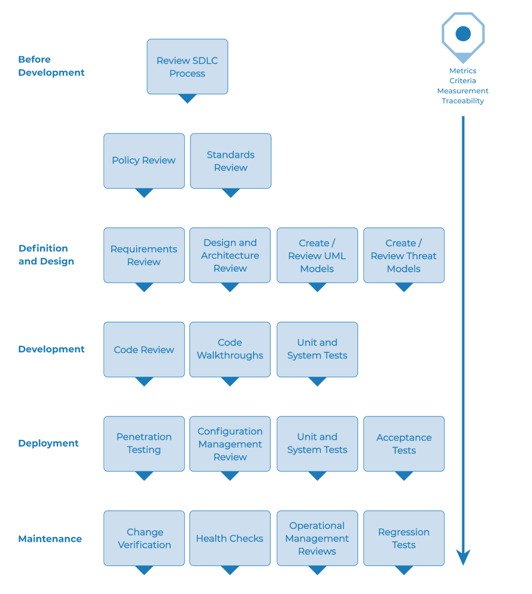

# El Marco de Pruebas de Seguridad Web

## Resumen

Esta sección describe un marco de pruebas típico que puede desarrollarse dentro de una organización. Puede considerarse un marco de referencia compuesto por técnicas y tareas adecuadas para las distintas fases del ciclo de vida del desarrollo de software (SDLC). Las empresas y los equipos de proyecto pueden utilizar este modelo para desarrollar su propio marco de pruebas y para evaluar el alcance de los servicios de pruebas de los proveedores. Este marco no debe considerarse prescriptivo, sino un enfoque flexible que puede ampliarse y adaptarse al proceso y la cultura de desarrollo de una organización.

Esta sección tiene como objetivo ayudar a las organizaciones a desarrollar un proceso de pruebas estratégico completo y no está dirigida a consultores o contratistas que suelen dedicarse a áreas de pruebas más tácticas y específicas.

Es fundamental comprender por qué desarrollar un marco de pruebas integral es crucial para evaluar y mejorar la seguridad del software. En *Writing Secure Code*, Howard y LeBlanc señalan que emitir un boletín de seguridad le cuesta a Microsoft al menos 100.000 dólares, y que la implementación de los parches de seguridad les cuesta a sus clientes en conjunto mucho más que eso. También señalan que el [sitio web sobre delitos cibernéticos](https://www.justice.gov/criminal-ccips) del gobierno estadounidense detalla casos penales recientes y las pérdidas para las organizaciones. Las pérdidas típicas superan con creces los 100.000 dólares estadounidenses.

Con una situación económica como esta, no sorprende que los proveedores de software pasen de realizar únicamente pruebas de seguridad de caja negra, que solo pueden realizarse en aplicaciones ya desarrolladas, a concentrarse en las pruebas en las primeras etapas del desarrollo de aplicaciones, como la definición, el diseño y el desarrollo.

Muchos profesionales de la seguridad aún consideran las pruebas de seguridad como pruebas de penetración. Como se mencionó en el capítulo anterior, si bien las pruebas de penetración desempeñan un papel importante, generalmente son ineficientes para detectar errores y dependen excesivamente de la habilidad del evaluador. Solo deben considerarse como una técnica de implementación o para concienciar sobre problemas de producción. Para mejorar la seguridad de las aplicaciones, es necesario mejorar la calidad de la seguridad del software. Esto significa probar la seguridad durante las etapas de definición, diseño, desarrollo, implementación y mantenimiento, sin depender de la costosa estrategia de esperar a que el código esté completamente compilado.

Como se explicó en la introducción de este documento, existen diversas metodologías de desarrollo, como el Proceso Unificado Racional, el desarrollo eXtreme y Agile, y las metodologías tradicionales en cascada. El objetivo de esta guía no es sugerir una metodología de desarrollo en particular ni proporcionar una guía específica que se ajuste a ninguna metodología en particular. En su lugar, presentamos un modelo de desarrollo genérico que el lector debe seguir según el proceso de su empresa.

Este marco de pruebas consta de actividades que deben realizarse:

- Antes del inicio del desarrollo,
- Durante la definición y el diseño,
- Durante el desarrollo,
- Durante la implementación, y
- Durante el mantenimiento y las operaciones.

## Fase 1 Antes del Inicio del Desarrollo

### Fase 1.1 Definir un SDLC

Antes de iniciar el desarrollo de la aplicación, se debe definir un SDLC adecuado, donde la seguridad sea inherente a cada etapa.

### Fase 1.2 Revisar Políticas y Estándares

Asegurarse de que existan políticas, estándares y documentación adecuados. La documentación es fundamental, ya que proporciona a los equipos de desarrollo directrices y políticas que pueden seguir. Solo se puede hacer lo correcto si se sabe qué es lo correcto.

Si la aplicación se va a desarrollar en Java, es fundamental que exista un estándar de codificación segura de Java. Si la aplicación va a utilizar criptografía, es fundamental que exista un estándar de criptografía. Ninguna política ni estándar puede abarcar todas las situaciones a las que se enfrentará el equipo de desarrollo. Al documentar los problemas comunes y predecibles, se reducirán las decisiones que se deben tomar durante el proceso de desarrollo.

### Fase 1.3 Desarrollar Criterios de Medición y Métricas y Garantizar la Trazabilidad

Antes de comenzar el desarrollo, planificar el programa de medición. Al definir los criterios que deben medirse, se proporciona visibilidad de los defectos tanto en el proceso como en el producto. Es fundamental definir las métricas antes de comenzar el desarrollo, ya que podría ser necesario modificar el proceso para capturar los datos.

## Fase 2: Definición y Diseño

### Fase 2.1: Revisión de los Requisitos de Seguridad

Los requisitos de seguridad definen el funcionamiento de una aplicación desde una perspectiva de seguridad. Es fundamental probarlos. En este caso, probar significa comprobar las suposiciones de los requisitos y comprobar si existen lagunas en sus definiciones.

Por ejemplo, si un requisito de seguridad exige que los usuarios estén registrados para acceder a la sección de documentación técnica de un sitio web, ¿significa esto que el usuario debe estar registrado en el sistema o debe autenticarse? Asegúrese de que los requisitos sean lo más claros posible.

Al identificar brechas en los requisitos, considere mecanismos de seguridad como:

- Gestión de usuarios
- Autenticación
- Autorización
- Confidencialidad de los datos
- Integridad
- Responsabilidad
- Gestión de sesiones
- Seguridad del transporte
- Segregación del sistema por niveles
- Cumplimiento legislativo y normativo (incluidos los estándares de privacidad, gubernamentales y del sector)

### Fase 2.2 Revisión del Diseño y la Arquitectura

Las aplicaciones deben contar con un diseño y una arquitectura documentados. Esta documentación puede incluir modelos, documentos textuales y otros elementos similares. Es fundamental probar estos elementos para garantizar que el diseño y la arquitectura garanticen el nivel de seguridad adecuado, según lo definido en los requisitos.

Identificar las fallas de seguridad en la fase de diseño no solo es una de las maneras más rentables de identificarlas, sino también una de las más efectivas para implementar cambios. Por ejemplo, si se identifica que el diseño requiere que las decisiones de autorización se tomen en múltiples ubicaciones, puede ser conveniente considerar un componente de autorización central. Si la aplicación realiza la validación de datos en múltiples ubicaciones, puede ser conveniente desarrollar un marco de validación central (es decir, solucionar la validación de entrada en un solo lugar, en lugar de en cientos, es mucho más económico).

Si se descubren debilidades, se deben comunicar al arquitecto del sistema para que considere alternativas.

### Fase 2.3 Creación y Revisión de Modelos UML

Una vez completado el diseño y la arquitectura, cree modelos de Lenguaje Unificado de Modelado (UML) que describan el funcionamiento de la aplicación. En algunos casos, estos modelos podrían ya estar disponibles. Utilice estos modelos para confirmar con los diseñadores de sistemas una comprensión precisa del funcionamiento de la aplicación. Si se detectan debilidades, estas deben comunicarse al arquitecto de sistemas para que considere alternativas.

### Fase 2.4 Creación y Revisión de Modelos de Amenazas

Con las revisiones de diseño y arquitectura, y los modelos UML que explican exactamente el funcionamiento del sistema, realice un ejercicio de modelado de amenazas. Desarrolle escenarios de amenazas realistas. Analice el diseño y la arquitectura para garantizar que estas amenazas se hayan mitigado, aceptado por la empresa o asignado a un tercero, como una aseguradora. Si las amenazas identificadas no tienen estrategias de mitigación, revise el diseño y la arquitectura con el arquitecto de sistemas para modificarlos.

## Fase 3 Durante el Desarrollo

En teoría, el desarrollo es la implementación de un diseño. Sin embargo, en la práctica, muchas decisiones de diseño se toman durante el desarrollo del código. A menudo se trata de decisiones menores que fueron demasiado detalladas para ser descritas en el diseño, o problemas para los que no se ofrecieron políticas ni directrices estándar. Si el diseño y la arquitectura no fueron adecuados, el desarrollador deberá tomar muchas decisiones. Si las políticas y estándares fueron insuficientes, deberá tomar aún más decisiones.

### Fase 3.1 Recorrido del Código

El equipo de seguridad debe realizar un recorrido del código con los desarrolladores y, en algunos casos, con los arquitectos del sistema. Un recorrido del código es una revisión general del código durante la cual los desarrolladores pueden explicar la lógica y el flujo del código implementado. Permite al equipo de revisión del código obtener una comprensión general del código y a los desarrolladores explicar por qué ciertos aspectos se desarrollaron de la forma en que se desarrollaron.

El objetivo no es realizar una revisión del código, sino comprender a fondo el flujo, el diseño y la estructura del código que compone la aplicación.

### Fase 3.2 Revisiones de Código

Con un buen conocimiento de la estructura del código y de por qué se codificaron ciertos elementos de esa manera, el evaluador puede examinar el código real en busca de defectos de seguridad.

Las revisiones estáticas de código validan el código con un conjunto de listas de verificación, que incluyen:

- Requisitos empresariales de disponibilidad, confidencialidad e integridad;
- Guía OWASP o las 10 listas de verificación principales para exposiciones técnicas (según la profundidad de la revisión);
- Problemas específicos relacionados con el lenguaje o el framework en uso, como el documento Scarlet para PHP o las listas de verificación de codificación segura de Microsoft para ASP.NET (https://msdn.microsoft.com/en-us/library/ff648269.aspx); y
- Cualquier requisito específico del sector, como Sarbanes-Oxley 404, COPPA, ISO/IEC 27002, APRA, HIPAA, directrices para comerciantes de Visa u otros regímenes regulatorios.

En términos de retorno de la inversión (principalmente tiempo), las revisiones estáticas de código generan resultados de mucha mayor calidad que cualquier otro método de revisión de seguridad y dependen menos de la habilidad del revisor. Sin embargo, no son una solución milagrosa y deben considerarse cuidadosamente dentro de un programa de pruebas de espectro completo.

Para más detalles sobre las listas de verificación de OWASP, consulte la última edición del [OWASP Top 10](https://owasp.org/www-project-top-ten/).

## Fase 4 Durante la Implementación

### Fase 4.1 Pruebas de Penetración de la Aplicación

Tras probar los requisitos, analizar el diseño y realizar la revisión de código, se puede asumir que se han detectado todos los problemas. Si bien es de esperar que así sea, realizar pruebas de penetración de la aplicación después de su implementación proporciona una comprobación adicional para garantizar que no se haya pasado por alto ningún problema.

### Fase 4.2 Pruebas de Gestión de la Configuración

La prueba de penetración de la aplicación debe incluir un examen de cómo se implementó y protegió la infraestructura. Es importante revisar aspectos de configuración, por pequeños que sean, para garantizar que no quede ninguno con una configuración predeterminada que pueda ser vulnerable a explotación.

## Fase 5 Durante el Mantenimiento y las Operaciones

### Fase 5.1 Realizar Revisiones de Gestión Operativa

Es necesario implementar un proceso que detalle cómo se gestiona la parte operativa tanto de la aplicación como de la infraestructura.

### Fase 5.2 Realizar Revisiones de Estado Periódicas

Se deben realizar revisiones de estado mensuales o trimestrales tanto de la aplicación como de la infraestructura para garantizar que no se hayan introducido nuevos riesgos de seguridad y que el nivel de seguridad se mantenga intacto.

### Fase 5.3 Garantizar la Verificación de Cambios

Después de que cada cambio se haya aprobado y probado en el entorno de control de calidad e implementado en el entorno de producción, es fundamental verificarlo para garantizar que el nivel de seguridad no se haya visto afectado. Esto debe integrarse en el proceso de gestión de cambios.

## Flujo de Trabajo Típico de Pruebas del SDLC

La siguiente figura muestra un flujo de trabajo típico de pruebas del SDLC.

\
*Figura 3-1: Flujo de trabajo típico de pruebas SDLC*
