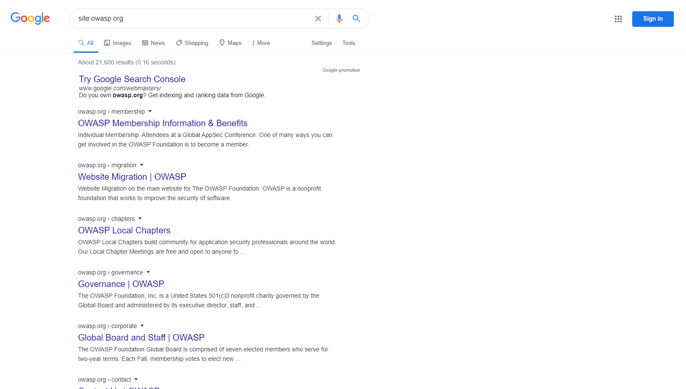
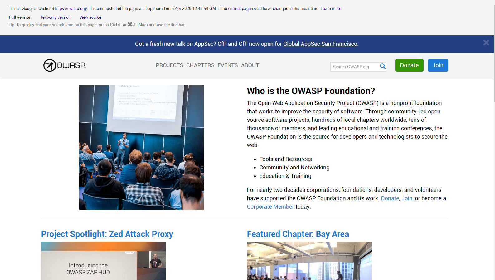

# Realizar Reconocimiento de Descubrimiento de Motores de Búsqueda para Detectar Fugas de Información

|ID |
|------------|
|WSTG-INFO-01|

## Resumen

Para que los motores de búsqueda funcionen, los programas informáticos (o "robots") extraen datos regularmente  [lo que se conoce como rastreo](https://en.wikipedia.org/wiki/Web_crawler)) de miles de millones de páginas web. Estos programas encuentran contenido y funcionalidad web siguiendo enlaces de otras páginas o consultando mapas de sitios. Si un sitio web utiliza un archivo especial llamado "robots.txt" para listar las páginas que no desea que los motores de búsqueda extraigan, estas páginas se ignorarán. Esta es una descripción general básica; Google ofrece una explicación más detallada de [cómo funciona un motor de búsqueda](https://support.google.com/webmasters/answer/70897?hl=en)..

Los evaluadores pueden usar motores de búsqueda para realizar reconocimiento en sitios web y aplicaciones web. Existen elementos directos e indirectos en el descubrimiento y reconocimiento de motores de búsqueda: los métodos directos se relacionan con la búsqueda en los índices y el contenido asociado de las cachés, mientras que los métodos indirectos se relacionan con el aprendizaje de información sensible de diseño y configuración mediante la búsqueda en foros, grupos de noticias y sitios de licitación.

Una vez que un robot de un motor de búsqueda completa el rastreo, comienza a indexar el contenido web basándose en etiquetas y atributos asociados, como `<TITLE>`, para devolver resultados de búsqueda relevantes. Si el archivo `robots.txt` no se actualiza durante la vida útil del sitio y no se han utilizado metaetiquetas HTML en línea que indican a los robots que no indexen el contenido, es posible que los índices contengan contenido web no previsto por los propietarios. Los propietarios del sitio pueden utilizar el archivo `robots.txt` mencionado anteriormente, las metaetiquetas HTML, la autenticación y las herramientas proporcionadas por los motores de búsqueda para eliminar dicho contenido.

## Objetivos de la prueba

- Identificar qué información sensible de diseño y configuración de la aplicación, el sistema o la organización está expuesta directamente (en el sitio web de la organización) o indirectamente (a través de servicios de terceros).

## Cómo realizar pruebas

Utilice un motor de búsqueda para buscar información potencialmente sensible. Esto puede incluir:

- Diagramas y configuraciones de red;
- Publicaciones y correos electrónicos archivados de administradores u otro personal clave;
- Procedimientos de inicio de sesión y formatos de nombre de usuario;
- Nombres de usuario, contraseñas y claves privadas;
- Archivos de configuración de terceros o de servicios en la nube;
- Revelar el contenido de los mensajes de error; y
- Aplicaciones no públicas (desarrollo, pruebas, pruebas de aceptación del usuario (UAT) y versiones de prueba de los sitios).

### Motores de búsqueda

No limite las pruebas a un solo proveedor de motor de búsqueda, ya que diferentes motores de búsqueda pueden generar resultados distintos. Los resultados de los motores de búsqueda pueden variar según la última vez que el motor rastreó el contenido y el algoritmo que utiliza para determinar las páginas relevantes. Considere utilizar los siguientes motores de búsqueda (ordenados alfabéticamente):

- [Baidu](https://www.baidu.com/), El buscador  [mas popular](https://en.wikipedia.org/wiki/Web_search_engine#Market_share) en china
- [Bing](https://www.bing.com/), el motor de búsqueda operado por Microsoft, y el segundo [más popular](https://en.wikipedia.org/wiki/Web_search_engine#Market_share) a nivel mundial. Admite [palabras clave de búsqueda avanzada](https://help.bing.microsoft.com/#apex/18/en-US/10001/-1).
- [binsearch.info](https://binsearch.info/), un motor de búsqueda para grupos de noticias binarios de Usenet.
- [Common Crawl](https://commoncrawl.org/), "un repositorio abierto de datos de rastreo web al que cualquier persona puede acceder y analizar".
- [DuckDuckGo](https://duckduckgo.com/), un motor de búsqueda centrado en la privacidad que recopila resultados de muchas diferentes [fuentes](https://help.duckduckgo.com/results/sources/). Admite [sintaxis de búsqueda](https://help.duckduckgo.com/duckduckgo-help-pages/results/syntax/).
- [Google](https://www.google.com/), Ofrece el motor de búsqueda [más popular](https://en.wikipedia.org/wiki/Web_search_engine#Market_share) del mundo, y utiliza un sistema de clasificación para intentar mostrar los resultados más relevantes.  Admite [operadores de búsqueda](https://support.google.com/websearch/answer/2466433).
- [Internet Archive Wayback Machine](https://archive.org/web/), "contruyen una biblioteca digital de sitios de Internet y otros artefactos culturales en formato digital".
- [Shodan](https://www.shodan.io/), Un servicio para buscar dispositivos y servicios conectados a internet. Las opciones de uso incluyen un plan gratuito limitado y planes de suscripción de pago.

### Operadores de búsqueda

Un operador de búsqueda es una palabra clave o sintaxis especial que amplía las capacidades de las consultas de búsqueda habituales y puede ayudar a obtener resultados más específicos. Generalmente se presenta en forma de `operator:query`. A continuación, se muestran algunos operadores de búsqueda comúnmente admitidos:

- `site:` limita la búsqueda al dominio proporcionado.
- `inurl:` solo muestra resultados que incluyen la palabra clave en la URL.
- `intitle:` solo muestra resultados que tienen la palabra clave en el título de la página.
- `intext:` o `inbody:` solo buscan la palabra clave en el cuerpo de las páginas.
- `filetype:` solo coincide con un tipo de archivo específico, por ejemplo, `.png` o `.php`.

Por ejemplo, para encontrar el contenido web de owasp.org indexado por un motor de búsqueda típico, la sintaxis requerida es:


```text
site:owasp.org
```

\
*Figura 4.1.1-1: Ejemplo de resultado de búsqueda de Google Site Operation*

### Visualización de contenido en caché

Para buscar contenido indexado previamente, utilice el operador `cache:`. Esto resulta útil para visualizar contenido que haya cambiado desde su indexación o que ya no esté disponible. No todos los motores de búsqueda ofrecen contenido en caché; la fuente más útil al momento de escribir este artículo es Google.

Para ver `owasp.org` tal como está en caché, la sintaxis es:

```text
cache:owasp.org
```

\
*Figura 4.1.1-2: Ejemplo de resultado de búsqueda de la operación de caché de Google*

### Hackeo de Google o Dorking

La búsqueda con operadores puede ser una técnica de descubrimiento muy eficaz cuando se combina con la creatividad del tester. Los operadores se pueden encadenar para descubrir eficazmente tipos específicos de archivos e información confidencial. Esta técnica, llamada [Google hacking](https://en.wikipedia.org/wiki/Google_hacking) o Dorking, también es posible usando otros motores de búsqueda, siempre que los operadores de búsqueda sean compatibles.

Una base de datos de dorks, como la [Google Hacking Database](https://www.exploit-db.com/google-hacking-database), Es un recurso útil que puede ayudar a descubrir información específica. Algunas categorías de dorks disponibles en esta base de datos incluyen:

- Puntos de apoyo
- Archivos con nombres de usuario
- Directorios sensibles
- Detección de servidores web
- Archivos vulnerables
- Servidores vulnerables
- Mensajes de error
- Archivos con información relevante
- Archivos con contraseñas
- Información sensible sobre compras en línea

## Remediación

Considere cuidadosamente la confidencialidad de la información de diseño y configuración antes de publicarla en línea.

Revise periódicamente la confidencialidad de la información de diseño y configuración publicada en línea.
